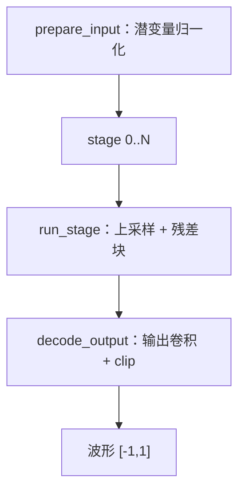
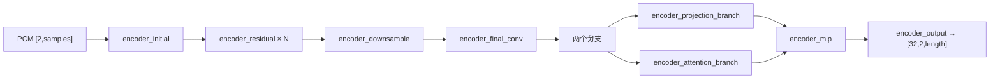

# 音频 VAE 编解码

`h3_audio_vae.c`（1343 行）实现 H3 的音频分支：一个**解码器（BigVGAN 风格）**把音频潜变量还原成 32 kHz 立体声波形，以及一个**编码器**把参考音频压成后验均值潜变量。

## 数据契约

```c
typedef struct {
    int channels;      /* 2 */
    int samples;
    int sample_rate;   /* 32000 */
    float *pcm;        /* 通道优先 F32，裁剪到 [-1,1] */
    h3_gpu_stats gpu_stats;
} h3_audio_waveform;

typedef struct {
    int channels;      /* 32 */
    int stereo;        /* 2 */
    int length;
    float *values;     /* 通道优先 F32 [32,2,length]，归一化后验均值 */
    h3_gpu_stats gpu_stats;
} h3_audio_latent;
```

| 函数 | 输入 | 输出 |
|---|---|---|
| `h3_audio_vae_decode` | `[32,2,T]` 归一化潜变量 | 32 kHz 立体声波形 |
| `h3_audio_vae_encode` | 通道优先 32 kHz 立体声 PCM `[2,samples]` | `[32,2,length]` 后验均值 |

编码器把输入**右侧补零到下一个 800 样本潜变量边界**。

Sources: [h3_audio_vae.h](h3_audio_vae.h#L8-L46)

## 解码器结构



每个 stage 由 `audio_stage` 描述，含若干 `audio_resblock`（残差块），每个残差块含若干 `audio_activation` 与 `audio_conv`。三个静态表驱动拓扑：

```c
static const int upsample_rates[];
static const int upsample_kernels[];
static const int residual_kernels[];
static const int residual_dilations[];
```

Sources: [h3_audio_vae.c](h3_audio_vae.c#L26-L68), [h3_audio_vae.c](h3_audio_vae.c#L519-L659)

## 权重归一化

BigVGAN 的卷积用 **weight norm**。加载路径是：

1. `load_plain_conv` / `load_normalized_conv` 读出 `weight_g`（magnitude）与 `weight_v`（vector）
2. `normalize_conv`（218）在 GPU 上用 `h3_gpu_weight_norm_f32` 合成真正的卷积核
3. `retire_normalization_inputs`（234）**立刻释放 `weight_g` / `weight_v`**——这一步直接决定峰值内存

Sources: [h3_audio_vae.c](h3_audio_vae.c#L155-L238)

## 关键 GPU 算子

`h3_gpu.h` 里为音频单列了一组算子，且注释明确了两条约定：

> - **激活是时间优先的 `[batch, length, channels]`**
> - **Conv1d 权重按 PyTorch OIK 序存，ConvTranspose1d 按 IOK 序存**

| 算子 | 用途 |
|---|---|
| `h3_gpu_conv1d_f32` / `h3_gpu_conv1d_stride_f32` / `h3_gpu_conv_transpose1d_f32` | 三种一维卷积 |
| `h3_gpu_weight_norm_f32` | weight norm 合成 |
| `h3_gpu_alias_free_snake_f32` / `h3_gpu_snake1d_f32` | BigVGAN 的周期性激活 |
| `h3_gpu_audio_qkv_split_f32` / `h3_gpu_sdpa_causal_f32` / `h3_gpu_audio_attention_pool_f32` | 编码器里的注意力分支 |
| `h3_gpu_geglu_f32` / `h3_gpu_clip_f32` | 编码器 MLP 与输出裁剪 |

Sources: [h3_gpu.h](h3_gpu.h#L196-L266)

## 编码器结构



`encoder_strides` / `encoder_dilations` 是静态表；`encoder_trace`（723）与 `encoder_conv_length`（746）用来预先算好每一层的输出长度，避免过度分配。

Sources: [h3_audio_vae.c](h3_audio_vae.c#L713-L985), [h3_audio_vae.c](h3_audio_vae.c#L1011-L1274)

## 一个重要的正确性修正

原生实现与**修正后的** MLX oracle 在真实两秒立体声 fixture 上相对 L2 达到 `3.59e-6`。这个修正很关键：

> 原始 MLX 的 reshape **交错了左右声道样本**，而官方 PyTorch / SGLang 路径把**完整立体声声道折叠进 batch 维度**。

`h3_audio_vae_encode` 走的是后一条（正确）路径。早期的交错解释是噪声诊断输出的根源之一，与 [模型加载与检查点布局](model-loading) 里 QKV 布局那处修正同源。

Sources: [README.md](README.md#L750-L757)

## 解码保真度

公开生成路径用流式原生 BigVGAN / AudioVAE 解码联合音频潜变量，输出与修正后 MLX oracle 的相对 L2 为 `6.94e-5`。

参考音频在编码后会混成 **0.999 干净潜变量 + 0.001 带种子噪声**，并钉在音频条件时间步 1.0，再打包成宽度 32 的行放到与视觉引用相同的旋转时间轴。

Sources: [README.md](README.md#L728-L748)

## 数值档位

与视频侧不同，音频解码**没有** int8 或流式开关：它相对 DiT 与视频 VAE 小得多，整段常驻即可。这也是 [自动内存规划](memory-plan) 把 `audio_vae` 的流式贡献算作 0 的原因（编码器/解码器逐调用释放）。

Sources: [h3.c](h3.c#L912-L915)
