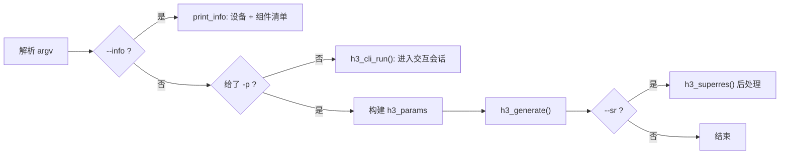
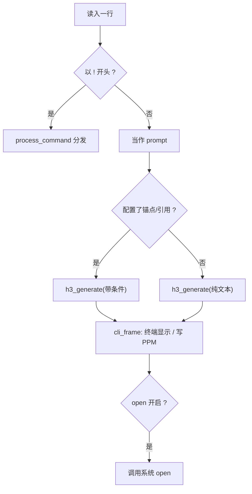

# 命令行与交互会话

CLI 由两个文件分担：`main.c` 负责一次性命令行解析与执行，`h3_cli.c` 负责交互式会话（基于 vendored 的 `linenoise`）。

## main.c：一次性模式

`main()` 解析 argv 后构造 `h3_params` 并调用 `h3_generate`；`--info` 走另一条只探测的分支。

完整的选项清单见 `usage()`。几个值得注意的解析细节：

- `--seconds N` 与 `--frames N` 互斥：秒数先乘 24 fps，再向上对齐到合法的 H3 时间形状。
- `--sr-target WxH` 用 `parse_wh()` 解析；`--sr-scale` 只在没有 `--sr-target` 时生效。
- 参考类选项（`--ref-image`、`--ref-video`、`--ref-audio` 等）**可重复，命令行顺序被保留**，直接对应 `<Picture N>` 的编号。

Sources: [main.c](main.c#L17-L73), [main.c](main.c#L86-L135)

## h3_cli.c：交互会话

会话状态集中在 `h3_cli_state`（`h3_cli.c:27`），包含一份 `h3_params`、锚点路径、引用数组、输出目录、SR 设置等。

### 命令一览

| 类别 | 命令 |
|---|---|
| 元信息 | `!help` `!status` `!quit` |
| 采样 | `!seed [N\|random]` `!steps [N]` `!reuse [N]` `!layers [N]` `!core-reuse [N]` |
| 画布 | `!size [WxH]` `!render-size [WxH\|native]` `!frames [N]` `!seconds [N]` |
| 加速开关 | `!token-reduction` `!ssd-streaming` `!int8-row-fc2` `!reference-rope`（均为 `[on\|off]`） |
| 条件 | `!first [PATH\|clear]` `!last [PATH\|clear]` `!ref-image PATH` `!refs [clear]` `!ref-remove N` |
| 输出 | `!show [on\|off]` `!zoom N` `!open [on\|off]` `!output [DIR]` `!save [PATH]` `!sr ...` |
| 复用 | `!again` `!cache [clear]` `!memory-plan [auto\|off]` |

`!status` 会打印当前对齐后的帧数、实际秒数、各加速档位，以及当前权重驻留方式（resident / SSD BF16 / int8 分组 / int8 row）。

Sources: [h3_cli.c](h3_cli.c#L157-L227)

### 会话内生成

`generate()` 位于 `h3_cli.c:442`，在调用 `h3_generate` 之前把会话状态同步进 `h3_params`。`cli_frame` 回调（`h3_cli.c:136`）负责终端图像显示与可选的 PPM 落盘。

Sources: [h3_cli.c](h3_cli.c#L442-L512), [h3_cli.c](h3_cli.c#L136-L155)

## 终端图像显示

`h3_terminal.c` 探测两种图形协议并直接向终端写转义序列：

| 协议 | 终端 |
|---|---|
| `H3_TERM_KITTY` | Kitty、Ghostty |
| `H3_TERM_ITERM2` | iTerm2、WezTerm、Konsole |

**显示尺寸默认为 2 倍**，以适配 macOS Retina；`--zoom N` / `!zoom N` 可改，只影响显示，不改变生成视频或编码图像。

Sources: [h3_terminal.h](h3_terminal.h#L7-L23), [README.md](README.md#L337-L340)

## 超分后处理

`--sr` 需要配合 `--sr-bin`（含 `realesrgan-ncnn-vulkan` 的目录）与 `--sr-model-dir`（含 `.bin` / `.param` 的目录）。这是**对已编码视频的后处理**，不是扩散流水线的一部分，因此失败会回退到低分辨率片段而不是中断整次运行。

分辨率策略：

- 给了 `--sr-target WxH` 且是内部分辨率的 2–4 整数倍 → 按该倍率精确放大；否则先 ×4 再用 ffmpeg 缩放到目标。
- 未给 target → 内部分辨率 × `--sr-scale`（默认 4）。

Sources: [h3_ffmpeg.h](h3_ffmpeg.h#L49-L58), [README.md](README.md#L357-L402)
