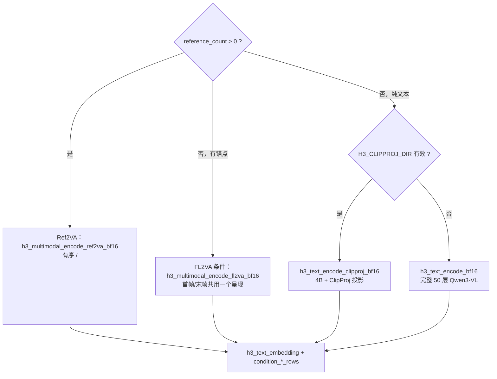

# 条件构建与多模态编码

条件构建把「一段文本 + 若干参考媒体」变成三样东西：一份 BF16 文本嵌入、一组视觉条件行、一组音频条件行。它是整条流水线里**分支最多**的一段。

## 三条互斥路径



Sources: [h3.c](h3.c#L1467-L1519)

## Ref2VA 参考处理

### 视觉部分

对每个非纯音频引用，先 `h3_ffprobe_visual_size` 拿到源尺寸，再按类型解析画布：

| 类型 | 画布规则 | 函数 |
|---|---|---|
| 图像 | 只缩不放、保持比例；`H3_REFERENCE_IMAGE_MAX` 时用 2048 短边上限 | `h3_reference_image_canvas` |
| 视频 | 目标风格画布，但更小的源**绝不放大小** | `h3_reference_video_canvas` |

图像用 `h3_ffmpeg_read_image_f32`（`H3_IMAGE_FIT_STRETCH`）解一帧；视频用 `h3_ffmpeg_read_video_f32` 按 24 fps 解到 `temporal.frame_count`，并**向下裁剪到发布的 `5+17k` 节拍**。

Sources: [h3.c](h3.c#L1108-L1178), [h3_host.h](h3_host.h#L101-L110)

### 视频的两帧分块与时间戳

Qwen 以**时间优先的两帧块**消费参考视频，而视觉 VAE 与媒体边界保持通道优先的 `[3,T,H,W]`。两者之间的转换由 `h3_extract_vision_pair` 完成。

采样与时间戳规则：

```c
size_t samples = (condition_frames + 11) / 12;   /* 每 12 帧取一个样本 */
size_t blocks  = (samples + 1) / 2;              /* 每 2 个样本一个块 */
/* 第 block 块取样本 2b 与 2b+1（越界则重复 2b） */
timestamp[block] = (first_sample + second_sample) / 4.0;
```

Sources: [h3.c](h3.c#L1151-L1173), [h3.c](h3.c#L850-L872)

### 音频部分

每个音频来源（`--ref-audio` / 视频内嵌音轨 / `--ref-video-audio` 的替换音轨）走同一段逻辑：

1. `h3_ffmpeg_read_audio_f32` 解成 **32 kHz 立体声 F32**，`max_samples` 上限 15 秒。视频音轨（`truncate=1`）允许静默截断，独立音频片段则报错而非静默裁剪。
2. `h3_audio_vae_encode` 走原生 AudioVAE 后验均值路径。
3. 混成 **0.999 干净潜变量 + 0.001 带种子的噪声**，钉在音频条件时间步 1.0。
4. 打包成宽度 32 的行，放在与视觉引用相同的旋转时间轴上。

约束：单个输入 2–15 秒；最多 3 个音频输入；总解码时长上限 15 秒；**纯音频引用必须伴随图像或视频引用**。

行打包顺序是 `[stereo, time, channel]`，而编码器输出是 `[channel, stereo, time]`，需要一次三重循环转置。

Sources: [h3.c](h3.c#L1190-L1294), [h3.c](h3.c#L1266-L1290)

## FL2VA 锚点

首帧与末帧**共用 Ref2VA 图像那套呈现**，但拟合方式不同，与参考实现一致：

| 锚点 | 拟合方式 | 键帧索引 |
|---|---|---|
| `--first-frame` | `H3_IMAGE_FIT_STRETCH`（拉伸到目标画布） | `0` |
| `--last-frame` | `H3_IMAGE_FIT_COVER`（比例覆盖后居中裁剪） | `frame_count - 1` |

Sources: [h3.c](h3.c#L1296-L1323), [h3.c](h3.c#L1054-L1058)

## 视觉条件行：VAE 编码 + patchify

不论哪条路径，只要存在视觉条件，都会先用**视觉 VAE 编码器**把像素压成潜变量，再切成 DiT 的行：

```c
int image_latent_t = h3_video_encoder_latent_t(condition_frames[image]);
size_t row_elements = image_latent_t * image_latent_h * image_latent_w / 4 * 96;
h3_video_vae_encode(vae_path, "h3_shaders.metal", pixels, frames, h, w, ..., &latent);
h3_dit_patchify_video(latent.values, 24, image_latent_t, latent_h, latent_w, rows, row_elements);
```

行宽 96 = 24 通道 × 2×2 patch。音频行宽 32 同理由 `h3_dit_pack_audio` 产出。

Sources: [h3.c](h3.c#L1362-L1401), [h3_dit.h](h3_dit.h#L48-L50)

## Qwen 视觉编码

视觉条件随后喂给 Qwen3-VL 的视觉塔（`h3_vision_encode_bf16`），产出：

- `merged`：BF16 呈现行
- `deepstack[3]`：三个同形状的 deepstack 增量，分别加在语言层 0、1、2 之后

图像只有一个输出；视频每个两帧块一个输出。详情见 [Qwen 视觉塔与 Deepstack](vision-encoder)。

Sources: [h3.c](h3.c#L1408-L1462), [h3_vision_encoder.h](h3_vision_encoder.h#L9-L33)

## 种子化条件增强

条件行装配完成后，`h3_augment_conditions` 会施加**0.999 的条件增强**（乘以 0.999 再加 0.001 量级的带种子噪声）。这是发布实现的一部分，不是可选的噪声注入。

Sources: [h3.c](h3.c#L312-L320), [h3.c](h3.c#L1533-L1539)

## 输出：h3_text_embedding

```c
typedef struct {
    size_t tokens;
    size_t width;          /* 5120 */
    uint16_t *values;      /* BF16 */
    h3_gpu_stats gpu_stats;
    uint8_t *tags;         /* 每行一个 DiT 模态 tag：语言=1，Qwen 视觉跨度=0 */
} h3_text_embedding;
```

`tags` 会一路传到 [AdaLN 调度与门控排序](dit-schedule) 的 `h3_dit_schedule_row_map`，决定每行吃到哪个模态的时间步。

Sources: [h3_text_encoder.h](h3_text_encoder.h#L11-L19), [h3_dit_schedule.h](h3_dit_schedule.h#L49-L55)
