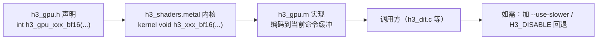

# 代码约定与扩展指南

## 语言与编译

- **严格 C11**：`-std=c11 -O3 -Wall -Wextra -Wpedantic -Wshadow -Wconversion -Wno-sign-conversion -D_DARWIN_C_SOURCE`
- `.m` 文件用 `-fobjc-arc`
- `linenoise.c` 是 vendored 的，**豁免** `-Wconversion`（Makefile 里单独加 `-Wno-conversion -Wno-variadic-macro-arguments-omitted`）

只有三个文件是 Objective-C：`h3_metal.m`、`h3_gpu.m`、`h3_tokenizer.m`。其余全是 C。

Sources: [Makefile](Makefile#L1-L9), [Makefile](Makefile#L219-L221)

## 源文件登记

**所有库源文件必须列进 `LIB_C` 或 `LIB_M`。** 只被 `#include` 而不登记的源文件会在链接期报 `Undefined symbols`——`h3_memory_plan.c` 就是这样被漏掉的。

新增一个 `.c` 文件到库里：

1. 写 `h3_<模块>.c` / `h3_<模块>.h`
2. 加进 `LIB_C`
3. `make clean && make`（`.d` 依赖文件需要重建）

Sources: [Makefile](Makefile#L11-L16), [AGENTS.md](AGENTS.md#L20-L22)

## 命名

| 元素 | 约定 | 例 |
|---|---|---|
| 公共 API | `h3_<名词>_<动词>` | `h3_load_dir`、`h3_generate` |
| 内部模块 API | `h3_<模块>_<动作>` | `h3_video_vae_decode`、`h3_dit_schedule_precompute` |
| GPU 算子 | `h3_gpu_<算子>_<dtype>` | `h3_gpu_linear_bf16`、`h3_gpu_adaln_f32` |
| Metal 内核 | `h3_<算子>_<dtype>[_<特化>]` | `h3_qkv_project_split_int8_rope_nax_r128_k5376_morton4` |
| 类型 | `h3_<名词>[_kind]` | `h3_layout`、`h3_segment_kind` |
| 文件内静态 | 无前缀 | `fail`、`gpu_op`、`load_block` |

## 错误处理

**没有异常，没有 errno，统一用「返回 0/NULL + 写错误缓冲」**：

```c
int some_operation(..., char *error, size_t error_size);
```

几乎每个模块都有一个本地 `fail()` 辅助（如 `h3_dit.c:223`、`h3_video_vae.c:107`、`h3_audio_vae.c:70`），它只是 `vsnprintf` 的 `format` 包装：

```c
static void fail(char *error, size_t error_size, const char *format, ...)
    __attribute__((format(printf, 3, 4)));
```

上下文级错误用 `h3_set_error(ctx, format, ...)`。

Sources: [h3_internal.h](h3_internal.h#L36-L37), [h3_dit.c](h3_dit.c#L223-L230)

## 资源释放：单一出口

大型函数（尤其 `h3_generate`）用**入口初始化 + 单一 `cleanup:` 出口**的写法：

```c
h3_result *result = NULL;
float *video = NULL, *audio = NULL;
/* 所有指针/标志在声明处初始化 */

/* ... 任何失败都 goto cleanup ... */

cleanup:
    free(video); free(audio);
    return result;
```

缓存存活靠标志排除：`if (!dit_is_cached) h3_dit_free(dit);`

Sources: [h3.c](h3.c#L947-L992), [h3.c](h3.c#L1789-L1824)

## 所有权

每个返回指针的 API 都在头文件注释里写明归属：

```c
/* The caller owns *ids and releases it with h3_tokenizer_ids_free(). */
int h3_tokenizer_encode(..., uint32_t **ids, ...);

/* The caller owns *output. */
int h3_resize_rgb24_high_quality(..., uint8_t **output);
```

**新 API 必须遵守这个约定并写明。**

Sources: [h3_tokenizer.h](h3_tokenizer.h#L15-L19), [h3_host.h](h3_host.h#L128-L134)

## 重复常量的同步义务

以下常量**有意在两处定义，改动必须同步**：

| 常量 | 位置 |
|---|---|
| `HIDDEN=5376` / `HEADS=56` / `HEAD_DIM=96` / `MLP=21504` / `H3_DIT_BLOCKS=50` | `h3_dit.h` 与 `h3_dit_schedule.h` |
| `H3_DIT_HIDDEN` / `H3_DIT_TIME_DIM` / `H3_DIT_MODALITIES` / `H3_DIT_ADALN_SLOTS` | `h3_dit_schedule.h`（与 `h3_dit.c` 的枚举对应） |

`H3_VIDEO_VAE_LAYERS` 则**必须**从 `h3_video_vae.h` 引入，**绝不硬编码**——内存规划器依赖它，硬编码会随真实块数静默漂移。

Sources: [AGENTS.md](AGENTS.md#L62-L64), [h3_video_vae.h](h3_video_vae.h#L20-L24)

## 保持同步的成对代码

| 成对 | 约束 |
|---|---|
| `run_resident_tile` / `run_stream_tile` | 都对 `vae->streaming` 分叉 |
| `decoder_decode_chunk` / `decode_chunked` | **两个解码入口都必须对流式标志分叉** |
| `h3_qkv_rope_bf16` / `h3_gpu_grouped_qkv_rope_bf16` | 前者 `[q/k/v,head,dim]`，后者 H3 的 `[head,q/k/v,dim]` |

Sources: [AGENTS.md](AGENTS.md#L44-L48), [h3_gpu.h](h3_gpu.h#L454-L465)

## 融合优化的义务

**每一项融合/特化都必须配一个回退开关**，形式二选一：

- CLI：`--use-slower-<对象>`
- 环境：`H3_DISABLE_FUSED_<名称>=1` / `H3_DISABLE_<名称>=1`

理由写在 README 里：这些开关不只是用户选项，更是**同一进程内做精确 A/B 的唯一手段**。新增融合时若没有回退路径，回归就无法定位。

Sources: [README.md](README.md#L502-L519), [README.md](README.md#L786-L874)

## 禁止引入的东西

- **不要引入 Python 或外部 ML 运行时**。项目的价值在于自包含的本机引擎。
- 不要依赖 Xcode 的可选离线 Metal 工具链（Metal 源码在运行时编译）。
- 不要引入第三方分词/JSON/媒体库（Foundation 与 ffmpeg 子进程已足够）。

Sources: [AGENTS.md](AGENTS.md#L50-L52), [README.md](README.md#L459-L467)

## 添加一个新算子的路径



## 添加一个新测试

1. 在 `tests/` 下新建 `test_<用途>.c`，独立 `main()`
2. 需要真实权重的用 `test_real_` 前缀
3. 在 `Makefile` 里加链接规则
4. 若应纳入 `make test`，用 `test -f <fixture>` 包一层并打印 `skip:` 提示
5. **不要**把测试塞进库

Sources: [AGENTS.md](AGENTS.md#L48-L50), [Makefile](Makefile#L36-L196)
