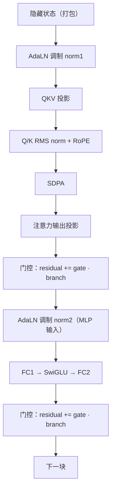

# DiT 块执行流程

`h3_dit.c` 的 `run_block`（2420）是单个 DiT 块的执行体。整个文件 3775 行，其中大量篇幅服务于「如何在不改变输出字节的前提下少做一次 dispatch、少读一次全局内存」。

## 一个块的权重

```c
typedef struct {
    h3_gpu_tensor *norm1, *norm2;
    h3_gpu_tensor *qkv, *qkv_int8, *qkv_scales;
    h3_gpu_tensor *q_norm, *k_norm;
    h3_gpu_tensor *out, *out_int8, *out_scales;
    h3_gpu_tensor *fc1, *fc2, *fc1_int8, *fc1_scales, *fc2_int8, *fc2_scales;
} h3_dit_block;
```

BF16 与 int8 两套并存。正常 int8 加载会在量化提交完成后**释放该块的 BF16 FC1/FC2 缓冲**——这是 int8 路径把峰值张量存储从 36.4 GiB 降到 25.9 GiB 的机制。

Sources: [h3_dit.c](h3_dit.c#L41-L58), [README.md](README.md#L780-L784)

## 标准块流程



Sources: [h3_dit.c](h3_dit.c#L2420-L2598)

## 三类融合

融合的**统一原则**：被舍入的 BF16 残差仍然精确写出，但同一行保留在 threadgroup 内存里供归一化复用，从而消掉一次 dispatch 与一次全局回读。

### 1. 门控 AdaLN 融合

每个活跃块把**注意力残差门控**与**紧随其后的 MLP AdaLN** 融合。`h3_gpu_gate_adaln_bf16` 一次完成两件事。

回退开关：`H3_DISABLE_FUSED_GATE_ADALN=1`

### 2. 跨块 AdaLN

在 **token 缩减边界之外**，MLP 残差门控还会产出**下一块的注意力 AdaLN**，并把归一化后的状态带过循环。

回退开关：`H3_DISABLE_FUSED_CROSS_BLOCK_ADALN=1`

### 3. 最终切片与最终头

- 最终音频/视频 AdaLN 内核**直接绑定到残差流的偏移量**上，省掉两次切片 blit 与 512×512 下 18.8 MiB（864 类几何下 29.4 MiB）的暂存。
  回退：`H3_DISABLE_FUSED_FINAL_SLICE=1`
- BF16 最终头在加载 16×16 投影瓦片时**顺带施加 AdaLN**，保留独立的舍入与累加顺序。
  回退：`H3_DISABLE_FUSED_FINAL_HEAD=1`

两项合计省下 37.5 / 58.9 MiB。

Sources: [README.md](README.md#L502-L519), [h3_gpu.h](h3_gpu.h#L420-L444)

## MLP 的两条路

| 路径 | 条件 | 入口 |
|---|---|---|
| 融合 BF16 图 | 默认 `H3_DISABLE_FUSED_MLP≠1` | 把 `fc1 → SwiGLU → fc2` 作为**一张缓存图**求值 |
| 分离操作 | `H3_DISABLE_FUSED_MLP=1` | 保留近参考的操作边界，用于数值诊断 |

融合路径避免独立的图边界与持久的中间张量。

Sources: [README.md](README.md#L767-L770), [h3_gpu.h](h3_gpu.h#L301-L315)

## int8 路径的融合

在 M5 int8 路径上，还有一串更细的融合（每项都有对应的 `--use-slower-*` 回退）：

| 融合 | 效果 | 回退开关 |
|---|---|---|
| QKV / MLP 激活量化折进前一个门控 AdaLN 内核 | 每次 50 层 forward 减少 99 次独立量化 dispatch | `--use-slower-unfused-int8-inputs` |
| Q/K RMS norm + RoPE 折进 int8 QKV 投影瓦片 | 字节一致，512 提升 2.1–3.2% | `--use-slower-unfused-qkv-rope` |
| SDPA 保留 `[head,row,dim]` 原生序，直投 int8 行主序 | 消掉全宽 BF16 转置 | `--use-slower-row-major-attention-output` |
| int8 注意力输出投影缓存 128 行/列 scale 到 1 KiB threadgroup | 512/864 提升 0.2–0.7% | `--use-slower-uncached-int8-scales` |
| FC1 用编译期 5376 宽的 TensorOps 循环 | 提升 0.1–0.4% | `--use-slower-dynamic-fc1-k` |

Sources: [README.md](README.md#L786-L856), [h3_gpu.h](h3_gpu.h#L484-L504)

## 专门化的投影内核

### 窄输出头

DiT 的音频/视频输出头很窄。它们的少量 F32 权重**一次性转成 BF16**，然后用 Iris 派生的 16×16 分块线性直接作用在 BF16 激活上。

生产 320 渲染几何下，成对输出头的隔离实测：**M3 Max 快 2.30×，M5 Max 快 1.83×**，相对 L2 `8.64e-4`。

回退：`H3_DIT_F32_FINAL=1`

### F32 patch 投影

`96→5376` 视频与 `32→5376` 音频的 patch 投影保留 F32 权重、输入与累加，只用**专门的 16×16 协作瓦片**并把瓦片结果直接舍入到 BF16。

生产形状下的成对实测：M3 快 1.77×，M5 快 1.62–1.78×，**生成的 RGB 流与标量路径逐字节相同**。

进一步把输出直接绑定进打包隐藏流，消掉 BF16 媒体暂存缓冲及其 blit：再省 19.13 / 29.83 MiB。连续 T2VA 用字节偏移；FL2VA/Ref2VA 用紧凑的目标行映射，使每个模态仍是一次大 dispatch。

回退：`H3_DISABLE_FUSED_PATCH_CAST=1`、`H3_SCALAR_PATCH=1`、`H3_DISABLE_FUSED_PATCH_PACK=1`

Sources: [README.md](README.md#L654-L681)

## 编码一次的 forward

`encode_forward`（2636）把一次速度场求值的所有 GPU 操作编码进命令缓冲。它受 [DiT 去噪与采样器](dit-denoise) 里描述的两段命令缓冲拆分控制（`command_block_interval`，231）。

Sources: [h3_dit.c](h3_dit.c#L223-L243), [h3_dit.c](h3_dit.c#L2636-L3014)
