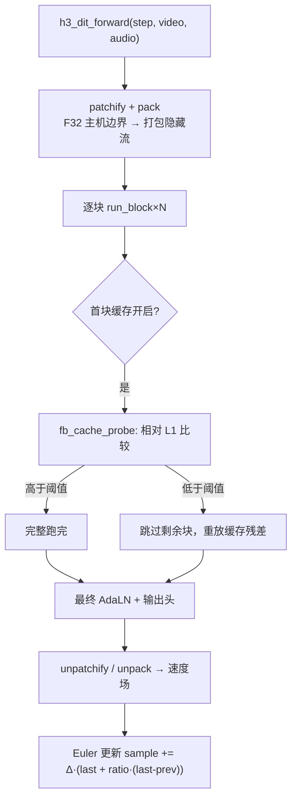

# DiT 去噪与采样器

DiT 是整条流水线里最贵的一段：一个 50 块的变换器，在 20 个 Euler 步上迭代，同时推进视频与音频两条潜变量。入口在 `h3_dit.c`，常量定义在文件头部的匿名枚举。

## 核心常量

```c
enum {
    TEXT_DIM = 5120,      HIDDEN = 5376,
    HEADS = 56,           HEAD_DIM = 128,
    INNER = HEADS * HEAD_DIM,   /* 7168 */
    FFN = 14336,
    VIDEO_CHANNELS = 24,  VIDEO_PATCH = 96,
    AUDIO_CHANNELS = 32,  AUDIO_STREAMS = 2,
    ROPE_FREQS = 16,      ROPE_HALF = 48,
    SLOTS = 6,            FINAL_SLOTS = 2
};
```

`H3_DIT_BLOCKS=50`、`H3_DIT_HIDDEN=5376`、`H3_DIT_TIME_DIM=2688`、`H3_DIT_MODALITIES=3`、`H3_DIT_ADALN_SLOTS=6` 在 `h3_dit_schedule.h` 中**有意重复定义**——改动时必须两处同步。

Sources: [h3_dit.c](h3_dit.c#L18-L33), [h3_dit_schedule.h](h3_dit_schedule.h#L11-L15)

## 加载：两条入口

| 入口 | 场景 |
|---|---|
| `h3_dit_load_t2va` | 纯文本 FL2VA |
| `h3_dit_load_conditioned` | FL2VA 锚点 / Ref2VA 有序参考 |

两者签名几乎相同，差别只在后者多接收视觉/音频条件行。加载顺序是**先文本精化与 AdaLN 预计算，后加载持久核心**——这样 498 MiB 的块投影在加载下一块前就已被释放。

Sources: [h3_dit.h](h3_dit.h#L20-L79), [h3_dit_schedule.h](h3_dit_schedule.h#L22-L30)

## 每一步做什么



Sources: [h3_dit.c](h3_dit.c#L2420-L2598), [h3_dit.c](h3_dit.c#L2599-L2635), [h3_dit.c](h3_dit.c#L2636-L3014)

## 采样器：独立位移 Euler 网格

默认采样器使用**视频与音频各自独立的位移 schedule**：

- 视频 sigma shift = 12.0，音频 sigma shift = 3.0
- `--steps N` **永远表示恰好 N 次去噪**，终端零在最后一次之后补上
- `h3_serving_schedule_build(evaluations, &schedule)` 用「线性基准网格 + 一个终端点」

`h3_dit_denoise_euler` 与 `h3_dit_denoise_euler_preview` 的差别只在后者每步后调用预览回调（会引入同步点，因此是 opt-in）。`h3_dit_denoise` 是更早的 RES 多步实现，仍保留。

Sources: [h3_host.h](h3_host.h#L12-L13), [h3_host.h](h3_host.h#L112-L117), [h3_dit.h](h3_dit.h#L101-L121)

## 三种省算策略

| 策略 | 参数 | 机制 | 互斥性 |
|---|---|---|---|
| **整体速度场复用** | `--reuse N` | 评估首步、末步及每第 N 步，跳过的步在各自 schedule 上外推速度场 | 与 `core_reuse` 互斥 |
| **核心残差复用** | `--core-reuse N` | 保留上一次的完整残差，每步只刷新 patch 投影与时间步感知头 | 与 `denoise_reuse` 互斥 |
| **层精简** | `--layers N` | 按 AdaLN 门控分数排序，保留前 N 块（保护结构上重要的首/末块） | 可与前两者叠加 |

`h3_dit_reuse_schedule(steps, reuse_interval, selected, count)` 生成评估掩码，返回评估次数。在 20 步下：reuse=1/2/3 分别对应 20 / 11 / 8 次全新 DiT 评估。

Sources: [h3_dit.h](h3_dit.h#L123-L127), [h3_dit.c](h3_dit.c#L3157-L3173), [h3.c](h3.c#L546-L558)

## 首块缓存（实验性）

`H3_FB_CACHE=1` 启用。每一步都跑第一个活跃 DiT 块，用相对 L1 度量比较其残差：

```
sum|r - r_prev| / sum|r_prev|
```

一个 Metal 内核把它规约成 1024 个 `[delta, magnitude]` 部分对，主机端收尾，**同一个 pass 里刷新缓存的首块残差**。低于阈值（`H3_FB_CACHE_THRESHOLD`，默认 0.12）就跳过剩余块、重放缓存的完整栈残差——首块残差几乎没动，意味着整叠块也会给出几乎相同的更新。

约束：

- 首步用于播种缓存；**末步永远完整跑**（其速度场从不被复用）
- `--ssd-streaming` 下禁用（预取环假设每个块都被按序消费）
- token reduction 活跃的步上禁用
- 需要最多三个额外的全隐藏 BF16 缓冲；其中两个与 `--core-reuse` 共享

Sources: [h3_dit.c](h3_dit.c#L35-L39), [h3_gpu.h](h3_gpu.h#L558-L567), [README.md](README.md#L561-L579)

## 数据边界：patchify 与 pack

主机边界的格式是 F32：`[24,T,H,W]` 视频、`[32,2,T]` 音频。进出 DiT 需要行序转换：

```c
int h3_dit_patchify_video(const float *latent, int channels, int time,
                          int height, int width, float *rows, size_t row_elements);
int h3_dit_unpatchify_video(const float *rows, int channels, int time,
                            int height, int width, float *latent, size_t latent_elements);
int h3_dit_pack_audio(const float *latent, int channels, int time,
                      float *rows, size_t row_elements);
int h3_dit_unpack_audio(const float *rows, int channels, int time,
                        float *latent, size_t latent_elements);
```

这四个函数被**刻意导出到内部头文件**，以便用便宜的主机测试钉住行序，而无需 62 GiB 的完整 checkpoint。

Sources: [h3_dit.h](h3_dit.h#L131-L142), [h3_dit.c](h3_dit.c#L3688-L3775)

## M5 GPU 采样器

M5 上默认的 serving Euler 采样器把 patch 打包后的 F32 潜变量与缓存的 BF16 速度场**都留在 Metal 缓冲里**：每次选定的去噪刷新在编码下一次之前完成，既避开 MPSGraph 背压，又消除了所有中间潜变量/速度场的回读与重打包。

这还省下每个视频潜变量元素约 16 字节的瞬态主机状态（768p 形状下约 136 MB）。M3 及更老的 GPU 默认保留 CPU 采样器。

| 环境变量 | 作用 |
|---|---|
| `H3_CPU_SAMPLER=1` | 在 M5 上恢复 CPU 采样器 |
| `H3_GPU_SAMPLER=1` | 显式选择 GPU 状态路径 |
| `H3_GPU_SAMPLER_WINDOW=0` | 开启较慢的无界提前编码诊断模式 |

Sources: [h3_dit.c](h3_dit.c#L3196-L3230), [README.md](README.md#L710-L719)

## 命令缓冲拆分与激活别名

DiT 核心被拆成**两个有序的 Metal 命令缓冲**，使第一部分的 GPU 执行与第二部分的 CPU 编码重叠。热平衡 ABBA 实测：M5 选 60% 深度拆分（30/50、27/45、24/40），M3 只拆实测有效的 30/50。

激活缓冲按**块内真实生命周期**别名复用：QKV 投影竞技场先后被注意力头、归一化后的 MLP 输入复用；注意力输出竞技场在其分支被消费后变成 MLP 输出。512 类几何下省 61.25 MiB，864 类下省 99.63 MiB，**不改变 dispatch 与算术**。

Sources: [h3_dit.c](h3_dit.c#L231-L243), [h3_dit.c](h3_dit.c#L1852-L2056), [README.md](README.md#L685-L697)
