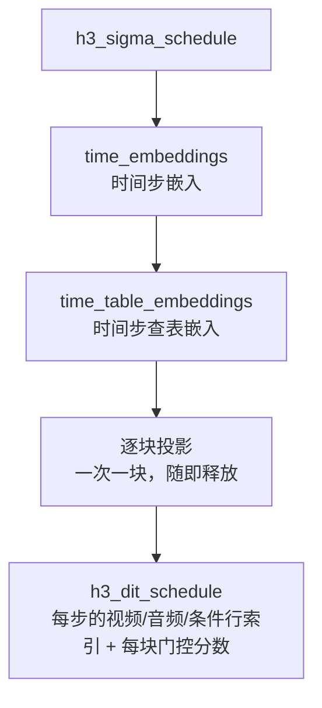
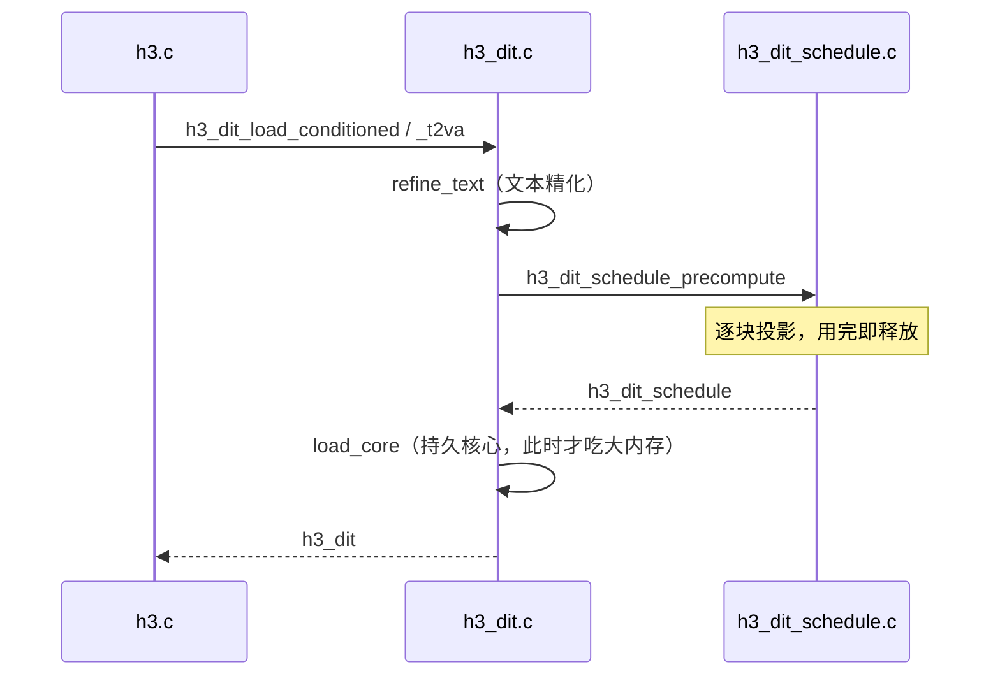

# AdaLN 调度与门控排序

`h3_dit_schedule.c`（716 行）在 DiT 主体加载**之前**先把每个去噪步的 AdaLN 调制值与门控分数**一次性算好**。这一步的设计目标是：让 498 MiB 量级的块投影在计算完就被释放，从而不占常驻内存。

## 常量

```c
#define H3_DIT_BLOCKS 50u
#define H3_DIT_HIDDEN 5376u
#define H3_DIT_TIME_DIM 2688u
#define H3_DIT_MODALITIES 3u
#define H3_DIT_ADALN_SLOTS 6u
```

这些常量在 `h3_dit_schedule.h` 与 `h3_dit.c` 里**有意重复**，改动必须两处同步。

Sources: [h3_dit_schedule.h](h3_dit_schedule.h#L11-L15)

## 预计算流程



`h3_dit_schedule_precompute` 的注释点明了核心设计：

> 刻意一次只提交一个投影，因此 498 MiB 的块投影会在加载下一个之前被释放。

Sources: [h3_dit_schedule.h](h3_dit_schedule.h#L22-L30), [h3_dit_schedule.c](h3_dit_schedule.c#L305-L407)

## 步骤查询

每步需要知道「这一行的调制值在哪一行」：

```c
uint32_t h3_dit_schedule_video_row(schedule, step);
uint32_t h3_dit_schedule_audio_row(schedule, step);
uint32_t h3_dit_schedule_visual_condition_row(schedule, step);
uint32_t h3_dit_schedule_audio_condition_row(schedule, step);
uint32_t h3_dit_schedule_time_rows(schedule);
```

视频与音频是**两条独立的位移 sigma 网格**（video shift 12.0、audio shift 3.0），因此各有自己的行索引。

Sources: [h3_dit_schedule.h](h3_dit_schedule.h#L33-L40), [h3_host.h](h3_host.h#L12-L13)

## 门控排序（层精简的基础）

```c
double h3_dit_schedule_gate_score(const h3_dit_schedule *schedule, unsigned block);
void   h3_dit_schedule_prune(h3_dit_schedule *schedule,
                             const uint8_t *active_blocks, size_t count);
```

`--layers N`（N < 50）不是简单地砍掉后 N 块，而是：

1. 对 checkpoint 中**实际的 AdaLN 门控值**排序
2. 按分数保留前 N 块
3. **保护结构上重要的首个与最终块**

被剪掉的块的权重与调度张量**不会被保留**，所以 `--layers 45` 与 `--layers 40` 同时减少变换器时间与统一内存占用——不只是省算力。

Sources: [h3_dit_schedule.h](h3_dit_schedule.h#L43-L46), [README.md](README.md#L495-L500)

## 行映射

```c
int h3_dit_schedule_row_map(const h3_dit_schedule *schedule, int step,
                            const h3_layout *layout,
                            const uint8_t *text_tags, size_t text_tag_count,
                            uint32_t *rows, size_t row_count);
```

这是把 [序列布局与位置编码](layout-and-rope) 和 AdaLN 内核连起来的桥梁。规则：

- `text_tags` 可为 NULL（所有 tag 取 1），或每行一个 tag
- **Qwen 视觉呈现跨度用 tag 0**（含其边界 token）
- 段类型（见 `h3_segment_kind`）决定该行吃**目标时间步还是条件时间步**，以及打到哪个模态

产物 `rows` 直接被融合的 AdaLN / 门控内核消费，无需在 GPU 上再做分支判断。

Sources: [h3_dit_schedule.h](h3_dit_schedule.h#L49-L55), [h3_dit_schedule.c](h3_dit_schedule.c#L665-L716)

## 权重读取的 dtype 处理

调度器要吃几种不同 dtype 的权重，因此有一组转换辅助：

| 函数 | 行 | 用途 |
|---|---:|---|
| `schedule_f16_to_f32` | 58 | F16 → F32 |
| `schedule_f32_to_bf16` | 82 | F32 → BF16 |
| `weight_f32_1d` / `weight_f32_2d` | 43 / 50 | F32 权重 |
| `weight_bf16_any` / `_1d` / `_2d` | 92 / 160 / 168 | 接受任意源 dtype 的 BF16 权重 |

Sources: [h3_dit_schedule.c](h3_dit_schedule.c#L43-L175)

## 在 DiT 加载中的位置



**顺序很重要**：如果先加载核心再算调度，峰值内存会高出 498 MiB 量级。

Sources: [h3_dit.h](h3_dit.h#L20-L22), [h3_dit.c](h3_dit.c#L1300-L1378), [h3_dit.c](h3_dit.c#L1737-L1851)
