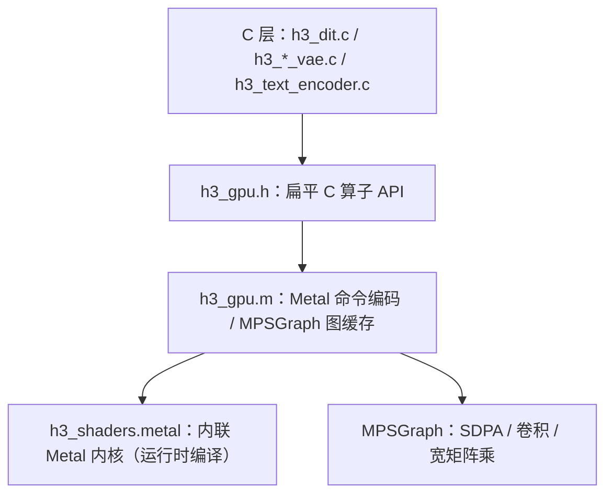

# GPU 抽象层（h3_gpu）

`h3_gpu.h` 是 C 侧的**设备抽象**，`h3_gpu.m`（4830 行，工程里最大的文件）是它的 Objective-C 实现。所有算子都是**扁平的 C 函数**，签名统一为 `int h3_gpu_xxx(h3_gpu *, 输出, 输入..., 形状参数)`，返回 0 表示失败。

## 分层



Sources: [h3_gpu.h](h3_gpu.h#L1-L9), [Makefile](Makefile#L16-L16)

## 张量

```c
typedef enum { H3_GPU_F32, H3_GPU_BF16, H3_GPU_I8, H3_GPU_U32 } h3_gpu_dtype;
```

张量是**共享 Metal 缓冲**的句柄，主机与 GPU 都能直接读写（统一内存）。两类创建方式：

| 方式 | 用途 |
|---|---|
| `h3_gpu_tensor_new_f32` / `_bf16` / `_i8` | 分配空张量 |
| `h3_gpu_tensor_from_f32` / `_bf16` / `_u32` | 从主机数组拷贝 |
| `h3_gpu_tensor_load_bf16` / `_f32` / `_i8` | **分配共享缓冲并 pread 文件字节进去** |

**文件直读是核心优化**：加载权重时中间不产生任何 host 分配。31 GB 级的 DiT 权重靠这条路径才能在合理内存内落地。

Sources: [h3_gpu.h](h3_gpu.h#L42-L57)

## 两个读文件变体

```c
int h3_gpu_tensor_read_file_bf16(...);    /* 普通 pread */
int h3_gpu_tensor_stream_file_bf16(...);  /* 请求 Darwin 不保留文件缓存副本 */
```

`stream` 变体请 Darwin **避免在文件缓存里保留第二份拷贝**，专供大顺序权重流使用——目标缓冲才是唯一有用的驻留副本。这是 [SSD 流式权重](ssd-streaming) 能维持 13–14.6 GiB/s 读吞吐的前提之一。

两者都**不改变张量及其记账**，因此可以在一个 I/O 线程上运行，同时另一个张量在 GPU 上飞行。

Sources: [h3_gpu.h](h3_gpu.h#L58-L69)

## 命令缓冲三段式

```c
int  h3_gpu_begin(h3_gpu *gpu);     /* 开始一个新命令缓冲 */
int  h3_gpu_continue(h3_gpu *gpu);  /* 提交当前缓冲但不等待，继续在同一有序队列上编码 */
int  h3_gpu_submit(h3_gpu *gpu);    /* 等待并校验整条链 */
```

`h3_gpu_continue` 是 [DiT 去噪与采样器](dit-denoise) 里「两段命令缓冲重叠」的实现基础：提交第一段、继续编码第二段，最后统一 `submit`。

Sources: [h3_gpu.h](h3_gpu.h#L94-L99)

## 算子目录

`h3_gpu.h` 导出约 90 个算子，按所属模型分：

| 分组 | 代表算子 |
|---|---|
| 通用 | `linear`、`cast`、`copy`、`silu`、`swiglu`、`scale_add`、`clip` |
| DiT | `adaln`、`gate`、`qkv_rope`、`sdpa`、`mlp_bf16`、`token_pool` / `token_expand`、`euler_bf16` |
| 文本 | `head_rms_norm`、`rope_text`、`gqa_causal`、`embedding` |
| 视觉 VAE | `vae_encoder_pad`、`conv3d`、`vae_encoder_group_norm_silu` |
| 音频 VAE | `conv1d` / `conv1d_stride` / `conv_transpose1d`、`weight_norm`、`alias_free_snake`、`snake1d`、`audio_attention_pool`、`geglu` |
| int8 | `quantize_weight_int8`、`linear_int8_bf16`、`mlp_int8_bf16`、`weight_dequant_unrotate_int8`、`convrot_remap_qkv_bf16` |

Sources: [h3_gpu.h](h3_gpu.h#L106-L634)

## 两套精度路径

| 路径 | 说明 |
|---|---|
| **F32** | 早期实现，主要保留给音频 VAE、视觉 VAE 与诊断 |
| **BF16** | 生产路径。**算术在 F32 累加，在操作边界舍入**，与发布 checkpoint 的计算 dtype 一致 |

`h3_gpu.h` 的注释明确了 BF16 的语义：

> 可移植 BF16 存储路径。算术在 F32 中累加并在操作边界舍入，匹配发布 checkpoint 的计算 dtype。

Sources: [h3_gpu.h](h3_gpu.h#L294-L300)

## 统计与性能剖析

```c
typedef struct {
    uint64_t allocated_bytes, live_bytes, peak_live_bytes;
    uint64_t tensor_allocations;
    uint64_t direct_dispatches, mps_linear_dispatches,
             mps_conv_dispatches, mps_sdpa_dispatches, blit_copies;
    uint64_t submissions;
    double command_encode_seconds, command_wait_seconds, gpu_seconds;
} h3_gpu_stats;
```

关于 `gpu_seconds` 有一条重要注释：

> 根 MTLCommandBuffer 时间戳；MPSGraph 可能在内部调度子缓冲，因此 `command_wait_seconds` 才是完整的周转测量。

`--profile` 报告的正是这三个时间维度。详见 [性能分析与诊断开关](profiling)。

Sources: [h3_gpu.h](h3_gpu.h#L17-L33), [h3_gpu.h](h3_gpu.h#L100-L104)

## 能力探测

```c
int h3_gpu_is_m5(const h3_gpu *gpu);
int h3_gpu_has_nax_mlp(const h3_gpu *gpu);
int h3_gpu_has_int8_mlp(const h3_gpu *gpu);
```

这三个谓词决定走哪条算子路径。选择是**运行时守卫**的：若 Metal 4 内核编译不可用，会静默回退到未改动的可移植库。

Sources: [h3_gpu.h](h3_gpu.h#L38-L40), [README.md](README.md#L634-L636)
