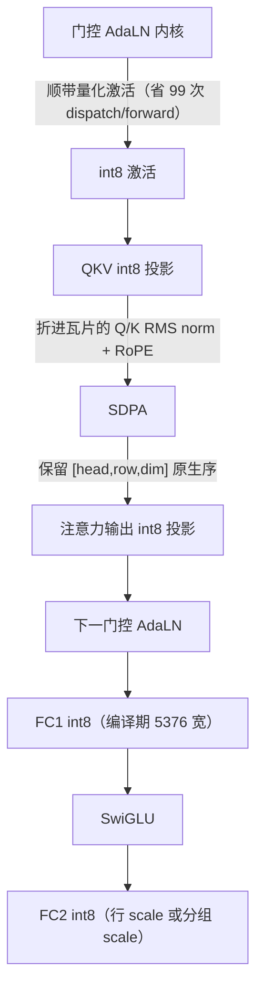

# int8 与 TensorOps 路径

M5 级 GPU（Metal 4）上，DiT 的默认路径是**原生 int8**：动态量化激活、每输出通道一个权重量化 scale、并对敏感的 FC2 输入每 1024 通道给一个 scale。这是把 512×512 的 50 层 19 次转换渲染从 36.30 秒压到 19.32 秒的那条路。

Sources: [README.md](README.md#L772-L799)

## 准入条件

```c
int h3_gpu_is_m5(const h3_gpu *gpu);
int h3_gpu_has_int8_mlp(const h3_gpu *gpu);
int h3_gpu_has_nax_mlp(const h3_gpu *gpu);
```

- `use_int8_row_fc2` 需要 `device.metal4`，否则 `h3_valid_params` 直接报错
- 更老的 Metal 硬件在所需原生 TensorOps 内核不可用时**自动选择**可移植的 BF16 MPS 路径
- 选择是运行时守卫的：编译失败会回退到未改动的可移植库

Sources: [h3.c](h3.c#L586-L589), [h3_gpu.h](h3_gpu.h#L38-L40)

## 量化方案

| 对象 | 方案 |
|---|---|
| 权重 | 每输出通道一个 F32 scale（`h3_gpu_quantize_weight_int8`） |
| 激活（一般） | 每 1024 通道分组量化（`h3_quantize_bf16_int8_groups*`） |
| FC2 输入（敏感） | 每 1024 通道一组 |
| FC2 行模式（`--use-int8-row-fc2`） | **每行一个激活 scale** + M5 全宽 K 内核 |

行模式更快但比分组 int8 **在数值上更激进**，因此是可选的。

Sources: [h3_gpu.h](h3_gpu.h#L316-L365), [README.md](README.md#L196-L201)

## 相关的 GPU 算子

```c
int h3_gpu_quantize_weight_int8(...);              /* 权重量化 */
int h3_gpu_linear_int8_bf16(...);                  /* 动态量化 + int8 GEMM */
int h3_gpu_linear_int8_head_major_bf16(...);       /* 直接消费 SDPA 的 [head,row,dim] 输出 */
int h3_gpu_mlp_int8_bf16(...);                     /* 融合 FC1→SwiGLU→FC2 的 int8 */
int h3_gpu_grouped_qkv_linear_rope_int8(...);      /* QKV int8 投影 + Q/K norm + RoPE */
int h3_gpu_gate_adaln_quantize_int8(...);          /* 门控 AdaLN + 顺带量化 */
int h3_gpu_weight_dequant_unrotate_int8(...);      /* ConvRot：反量化 + 反旋转 */
int h3_gpu_convrot_remap_qkv_bf16(...);            /* ConvRot：q/k/v 行重排 */
```

Sources: [h3_gpu.h](h3_gpu.h#L318-L504)

## 融合链



Sources: [README.md](README.md#L786-L856)

## 逐项收益与回退

| 融合 / 特化 | 实测收益 | 回退开关 |
|---|---|---|
| 基础 int8 MLP vs BF16 MPS | 36.30 s → 25.80 s | `--use-slower-bf16-mlp` |
| int8 QKV 投影 | 25.80 s → 19.32 s | `--use-slower-bf16-qkv` |
| int8 注意力输出投影 | 再 4.5–5.5% | `--use-slower-bf16-attention-output` |
| 激活量化折进门控 AdaLN | 0.3–0.6% | `--use-slower-unfused-int8-inputs` |
| Q/K norm + RoPE 折进 QKV 瓦片 | 512: 2.1–3.2% | `--use-slower-unfused-qkv-rope` |
| SDPA 原生 head-major 直投 | 0.2–1.2% | `--use-slower-row-major-attention-output` |
| int8 scale 缓存在 threadgroup | 0.2–0.7% | `--use-slower-uncached-int8-scales` |
| FC1 编译期 5376 宽循环 | 0.1–0.4% | `--use-slower-dynamic-fc1-k` |
| FC2 激活量化的 128 线程精确规约（≤2048 行） | 0.2–0.8% | `--use-slower-grouped-quantizer` |

Sources: [README.md](README.md#L772-L874)

## NAX（Metal 4 原生线性）

| 环境变量 | 语义 |
|---|---|
| `H3_NAX=0` | 禁用 TensorOps，做精确 A/B 诊断 |
| `H3_NAX=1` | 强制更宽的原生 BF16 线性路径（**opt-in**：微基准偏好其 128 行瓦片，但完整 DiT 运行目前更偏好 MPSGraph 调度） |
| `H3_NAX=mlp` | 更专门的路径：成对 FC1 gate/up TensorOps 瓦片在 threadgroup 内存里做 SwiGLU，只写出 14336 宽的激活中间量，FC2 也留在 TensorOps 上 |
| `H3_DISABLE_NAX_MLP=1` | 在以此方式创建的上下文里保留 MPSGraph MLP，用于同进程 A/B |

`H3_NAX=mlp` 之所以刻意 opt-in，是因为**调度依赖 OS GPU 栈**：主要测试机（macOS 26.5.2 M5 Max）在隔离真实权重 MLP 上快 1.3–2.0%，但完整 50 块 forward 慢 1–3%；另一台同配置的 macOS 26.5 M5 Max 在同上下文 A/B 中快 1.4%。两者得到的 50 块速度场接近（视频 1.9%、音频 2.4% 相对 L2）但**不逐字节相同**。

Sources: [README.md](README.md#L638-L652)

## 峰值内存

正常 int8 加载会在每个块的量化提交完成后**释放该块的 BF16 FC1/FC2 缓冲**，把实测峰值张量存储从 BF16 路径的 36.4 GiB 降到 **25.9 GiB**。

代价是**运行时权重量化增加了启动时间**。

当前的诊断实现只在 A/B 诊断请求时同时保留 BF16 与 int8 MLP 权重。

Sources: [README.md](README.md#L780-L784)

## ConvRot int8

`h3_weights.c` 支持一种 int8 权重存储：读 int8 + scale，用**快速 Walsh-Hadamard 反旋转**还原成真 BF16 权重。

```c
uint32_t layout = (source->field == STREAM_QKV) ? 1u : 0u;
for (uint32_t start = 0; start < rows; start += 1024)
    convrot_unrotate_cpu(raw + start * cols, scales + start, full,
                         start, count, cols, layout, HEADS, HEAD_DIM);
```

`layout == 1` 表示 `qkv_proj` 是以 q/k/v 交错存的，需要重排到分离布局，使反旋转后的权重落在真实行上。

这条路径**在 CPU 上完成**（不发 GPU 命令，主线程拥有命令缓冲），之后 GPU 上只做 M5 流式块的 int8 重量化。

Sources: [h3_dit.c](h3_dit.c#L1049-L1106), [h3_weights.c](h3_weights.c#L160-L206), [h3_dit.c](h3_dit.c#L525-L673)

## 与流式的关系

**int8 与 SSD 流式是正交的**（流式 = 权重住哪，int8 = 权重怎么压），这一点在 `h3_memory_plan.h` 的注释里被明确强调，也是从 ds4 的解耦路由 / expert 缓存设计借鉴来的。

但在**用户显式指定**的层面，二者仍互斥：`h3_valid_params` 拒绝 `ssd_streaming && use_int8_row_fc2`。

Sources: [h3_memory_plan.h](h3_memory_plan.h#L21-L29), [h3.c](h3.c#L577-L581)
