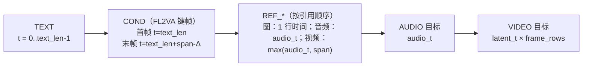

# 序列布局与位置编码

H3 把**文本、条件、参考、目标视频、目标音频**拼成一条统一的 1-D token 序列，每个 token 带一个 `(t, h, w)` 三元组位置。这份布局（`h3_layout`）是 DiT 唯一的结构信息来源。

## 段类型

```c
typedef enum {
    H3_SEG_TEXT,        /* 语言 token */
    H3_SEG_COND,        /* FL2VA 首/末帧条件行 */
    H3_SEG_REF_IMAGE,   /* Ref2VA 图像或视频呈现行 */
    H3_SEG_REF_AUDIO,   /* Ref2VA 音频条件行 */
    H3_SEG_AUDIO,       /* 目标音频 token */
    H3_SEG_VIDEO        /* 目标视频 token */
} h3_segment_kind;
```

## 布局构造顺序

`h3_layout_build` 严格按下图顺序 emit，游标 `cursor` 沿时间轴单调推进：



关键规则：

- **文本**：`t = index`，`h = w = 0`。
- **FL2VA 键帧**：只接受首帧（`keyframe == 0`）与末帧（`keyframe == frame_count - 1`），其它值直接报错。末帧的时间是 `text_len + h3_video_span_sum(latent_t) - h3_frame_rescale`，即整段视频时间跨度的最末端。
- **Ref2VA 图像**：整幅图挤在同一个时间 `cursor` 上，游标前进 `1.0`。
- **Ref2VA 视频**：若有音轨，音频段先 emit（用该引用的 w 轴范围），再 emit 视频段；游标前进 `max(audio_t, video_span)`。
- **键帧与引用互斥**。

Sources: [h3_host.c](h3_host.c#L313-L464), [h3_host.h](h3_host.h#L28-L41)

## 空间网格

`h3_frame_grid` 生成 `latent_h × latent_w` 的 `(h, w)` 网格。同一 `latent_t` 帧内的所有空间位置共享同一个 `t`。

`t` 的推进不是等距的：

```c
time += h3_frame_rescale * h3_frame_per_token[index % 5];
```

`h3_frame_per_token` 是一个 **5 元素周期表**，对应发布的视频时间压缩节奏——这也是为什么帧数必须对齐到 `5 + 17*n`。

Sources: [h3_host.c](h3_host.c#L231-L311), [h3_host.c](h3_host.c#L12-L13)

## 时间形状

| 函数 | 语义 |
|---|---|
| `h3_align_frame_count(requested)` | 向上对齐到 `5 + 17*n`，上限 362 |
| `h3_video_latent_t(frames)` | 目标视频潜变量的 T |
| `h3_video_encoder_latent_t(frames)` | VAE 编码器的因果 `ceil(T/4)` 压缩 |
| `h3_temporal(frames)` | 一次算出 `{frame_count, video_t, audio_t}` |

音频潜变量按 40 fps 推进（`H3_AUDIO_LATENT_FPS`），视频 24 fps，因此 `audio_t` 与 `video_t` 是两条独立的时间轴。

Sources: [h3_host.h](h3_host.h#L7-L20), [h3_host.h](h3_host.h#L95-L98)

## 画布换算

```c
void  h3_latent_canvas(int width, int height, int *latent_w, int *latent_h);
int   h3_adapt_canvas(int width, int height, int *adapted_w, int *adapted_h);
int   h3_reference_image_canvas(int w, int h, int tw, int th,
                                int max_short_edge, int *aw, int *ah);
int   h3_reference_video_canvas(int w, int h, int *aw, int *ah);
```

视频潜变量空间比是 16（`H3_VAE_SPATIAL_RATIO`），因此 `latent = pixel / 16`。

Sources: [h3_host.h](h3_host.h#L11-L110)

## 256×256 的 RoPE 自适应

在**恰好 256×256** 的原生画布上，H3 只有 `8×8` 的有效空间 token 网格，细部与复杂构图空间紧张。引擎默认把空间 RoPE 坐标**减半**：

```c
float spatial_rope_scale = !params->use_reference_rope &&
    render_width == 256 && render_height == 256 ? 0.5f : 1.0f;
```

这消除了长渲染里重复的格状伪影，在独立人像测试上也保持连贯，且不增加 token 与运行时间。`--use-reference-rope` 可恢复发布/MLX 的坐标用于对齐检查。

**128×128 仍然不支持**：其 `4×4` token 网格即使调整 RoPE 也无法恢复可识别的主体。

Sources: [h3.c](h3.c#L1556-L1557), [README.md](README.md#L272-L291)

## 行映射：从布局到 AdaLN 行

`h3_dit_schedule_row_map` 把布局转换成融合 AdaLN / 门控内核直接消费的行映射表。输入包含：

- `layout`：段区间
- `text_tags`：每行的模态 tag（语言=1，Qwen 视觉跨度及其边界 token=0）

段类型决定该行吃**目标时间步还是条件时间步**，以及打到哪个模态。详见 [AdaLN 调度与门控排序](dit-schedule)。

Sources: [h3_dit_schedule.h](h3_dit_schedule.h#L49-L55), [h3_dit_schedule.c](h3_dit_schedule.c#L665-L716)

## 随机流

去噪初始化用**两个独立的 PCG 风格 RNG，同一种子**——与发布服务端一致：

```c
h3_rng_seed(&video_rng, params->seed);
h3_rng_seed(&audio_rng, params->seed);
h3_rng_fill_normal(&video_rng, video, video_count);
h3_rng_fill_normal(&audio_rng, audio, audio_count);
```

RNG 状态是一个 64 位 LCG 加一个正态 spare（Box-Muller 成对产出，缓存另一半）。

Sources: [h3.c](h3.c#L1665-L1671), [h3_host.h](h3_host.h#L88-L93), [h3_host.c](h3_host.c#L494-L528)
