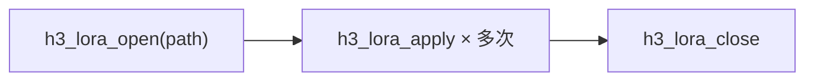

# LoRA 合并

`h3_lora.c`（227 行）实现 Turbo / distillation LoRA 的**加载时合并**。合并发生在统一内存中，推理仍然用普通的 BF16 矩阵——没有额外的运行时算子。

## 支持的格式

MiniMax-H3 的加速 LoRA（LightX2V Turbo、官方 Lightning）是标准 safetensors 文件，含 BF16 低秩因子与 Diffusers 风格的键布局：

```
transformer_blocks.N.attn.to_q.lora_A.default.weight
transformer_blocks.N.attn.to_q.lora_B.default.weight
transformer_blocks.N.attn.to_k / attn.to_v / attn.to_out.0
transformer_blocks.N.ff.net.0.proj    (MLP 输入)
transformer_blocks.N.ff.net.2         (MLP 输出)
token_refiner.refiner_blocks.N.*      (同样的子键)
```

Sources: [h3_lora.h](h3_lora.h#L8-L27)

## 合并公式

```
W' = W + scale · (B @ A)
A: [r, in]    B: [out, r]    scale = alpha / rank
```

`alpha` 从 safetensors 的 `__metadata__` 块里读——但张量解析器会跳过 `__metadata__`，所以 `h3_lora_open` 会**重新打开原始文件、读出 JSON 头、手工找 `"alpha"`**：

```c
const char *alpha_key = strstr(json, "\"alpha\"");
if (alpha_key) {
    alpha_key = strchr(alpha_key + 7, ':');
    /* 跳过 :、" 、空格、制表符 */
    alpha = (float)strtod(alpha_key, NULL);
    if (!(alpha > 0.0f)) alpha = 1.0f;
}
lora->scale = alpha / (float)lora->rank;
```

rank 则从第一个 `lora_A` 因子的 `shape[0]` 推出。Diffusers 把 alpha 写成 JSON 字符串（如 `"128"`），所以拷贝出时必须跳过引号。

Sources: [h3_lora.c](h3_lora.c#L64-L109)

## 行带更新

```c
int h3_lora_apply(h3_gpu *gpu, h3_lora *lora, h3_gpu_tensor *weight,
                  const char *lora_prefix, const char *target,
                  size_t row0, size_t rows, size_t in_dim,
                  char *error, size_t error_size);
```

| 参数 | 取值 |
|---|---|
| `lora_prefix` | `"transformer_blocks.N"` 或 `"token_refiner.refiner_blocks.N"` |
| `target` | `"attn.to_q"` / `"attn.to_k"` / `"attn.to_v"` / `"attn.to_out.0"` / `"ff.net.0.proj"` / `"ff.net.2"` |

**只有行带 `[row0, row0+rows)` 被更新**，因此多个目标（q/k/v）可以共享同一份存储张量（`qkv_proj`）——这与 DiT 块里 `qkv` 是单个张量的事实直接对应。

替换规则：该行带被替换为「旧值 + GPU 上算出的 LoRA 增量」。

Sources: [h3_lora.h](h3_lora.h#L37-L52), [h3_dit.c](h3_dit.c#L41-L58)

## 生命周期



`h3_lora` 结构体极简：

```c
struct h3_lora {
    h3_st_header header;
    float scale;    /* alpha / rank */
    size_t rank;
};
```

Sources: [h3_lora.c](h3_lora.c#L11-L15), [h3_lora.c](h3_lora.c#L111-L115)

## 不改写 checkpoint

`h3.c` 消费的是官方 BF16 checkpoint（`model.language_model.layers.N.*` 用于文本，`blocks.N.*` 用于 DiT），**从不回写这些文件**。合并只在统一内存里发生。

Sources: [h3_lora.h](h3_lora.h#L23-L26)

## 约束

**SSD 流式与 int8 量化路径不支持合并。** 原因是这两条路径都不保留完整的 BF16 常驻权重供原地更新：

- `ssd_streaming` 只保留 2 个 BF16 块槽位，轮转覆盖
- int8 路径在量化完成后就释放了 BF16 缓冲

因此 `--lora` 与 `--ssd-streaming` 不能同时使用。

Sources: [h3_lora.h](h3_lora.h#L26-L27), [h3.h](h3.h#L99-L102)

## 参数传递

`lora_path` 是 `h3_params` 的一个字段，直接透传给 DiT 的两个加载入口：

```c
dit = h3_dit_load_conditioned(dit_path, "h3_shaders.metal", &text, &layout, &sigmas,
                              ..., params->ssd_streaming,
                              params->lora_path,
                              spatial_rope_scale, ...);
```

Sources: [h3.h](h3.h#L99-L102), [h3.c](h3.c#L1571-L1591), [h3_dit.h](h3_dit.h#L31-L32)

## 测试

`tests/test_lora.c` 配合 `tests/gen_lora_data.py`（生成已知答案的合成 LoRA）验证合并的数值正确性：

```sh
make h3_lora_tests && ./h3_lora_tests
```

注意 `make test` 的默认目标里**没有**包含 `h3_lora_tests`——它是一个独立目标，需要显式构建与运行。

Sources: [Makefile](Makefile#L48-L49), [Makefile](Makefile#L115-L121)
