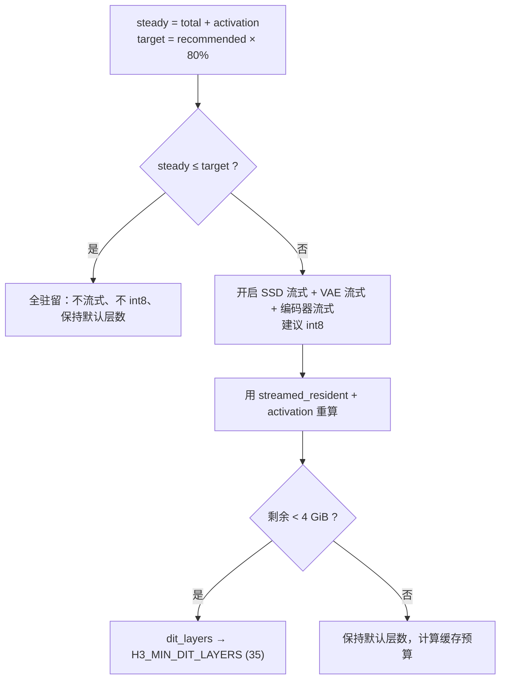

# 自动内存规划

`h3_memory_plan.c`（112 行）是一个**小而关键的决策器**：给定设备的 `recommended_working_set` 与模型驻留开销，自动决定 SSD 流式、int8、VAE 流式、编码器流式与 DiT 层数。目标是让 16/24 GB 的小内存 Mac **无需手工调参**就能跑起来。

它的设计精神移植自 ds4/DwarfStar 的 SSD 流式缓存规划器（`ds4_ssd_auto_cache_plan` / `ds4_streaming_manual_cache_safe_bytes`）。

Sources: [h3_memory_plan.h](h3_memory_plan.h#L8-L19)

## 输入与输出

```c
int h3_memory_plan_auto(const h3_device_info *device,
                        uint64_t total_weight_bytes,
                        uint64_t streamed_resident_bytes,
                        uint64_t activation_bytes,
                        h3_memory_plan *out);
```

| 输入 | 含义 |
|---|---|
| `total_weight_bytes` | 五个组件**全驻留**的字节总和 |
| `streamed_resident_bytes` | **施加流式之后**的驻留量：DiT 只留 ~2 块、VAE 解码器只留 ~1 块、编码器逐调用释放（贡献 ~0） |
| `activation_bytes` | 粗略的峰值激活缓冲（潜变量、VAE 瓦片、PCM） |
| `device` | 探测到的设备信息 |

```c
typedef struct {
    int ssd_streaming;
    int use_int8_row_fc2;
    int dit_layers;              /* 0 表示保持 h3_params 默认 */
    int video_vae_streaming;
    int encoder_streaming;
    uint64_t cache_budget_bytes;
    char reason[256];
} h3_memory_plan;
```

Sources: [h3_memory_plan.h](h3_memory_plan.h#L21-L62)

## 决策逻辑



**关键设计点**：第二个分支用的是 `streamed_resident_bytes` 而**不是** `total_weight_bytes`。注释解释得很直接：

> 因此规划器不会长期高估内存：流式下 DiT 只驻留 2 个块、VAE 解码器只驻留 1 个块、编码器逐调用释放。

早期版本用全量估算，会导致几乎所有机器都被判为"必须流式"。

Sources: [h3_memory_plan.c](h3_memory_plan.c#L39-L93)

## int8 与流式解耦

注释里明确说明这是一个**有意的改变**：

> int8 与 ssd_streaming 不再互斥：两者是正交的（流式 = 权重住哪，int8 = 权重怎么压），镜像 ds4 的解耦路由 / expert 缓存设计。

因此在流式分支里 `use_int8_row_fc2` 也被置 1（由调用方检查 `metal4`）。

Sources: [h3_memory_plan.h](h3_memory_plan.h#L21-L29), [h3_memory_plan.c](h3_memory_plan.c#L63-L66)

## 缓存预算

```c
uint64_t h3_memory_cache_budget_bytes(const h3_device_info *device,
                                      uint64_t steady_state_bytes);
```

规则（镜像 ds4 的 `ds4_streaming_manual_cache_safe_bytes`）：

- 目标 = `recommended_working_set × 7/8`
- 减去稳态（模型 + 激活）开销
- 向下对齐到 GiB
- 若结果非零但不足 1 GiB，取 1 GiB

Sources: [h3_memory_plan.c](h3_memory_plan.c#L97-L112)

## 调用方如何估算输入

`h3_generate` 里的估算是**近似的但方向保守**：

```c
uint64_t activation = (uint64_t)eff.width * eff.height * eff.frames / 16 / 16 * 56 * 4
                    + 1024ull * 1024 * 1024;    /* 1 GiB 余量 */

const uint64_t dit_resident  = 2 * (dit_blocks / H3_DEFAULT_DIT_LAYERS);
const uint64_t vae_resident  = ctx->model.video_vae.bytes / H3_VIDEO_VAE_LAYERS;
const uint64_t streamed_resident = dit_resident + vae_resident;
/* text_encoder 与 audio_vae 逐调用释放，贡献 0 */
```

注意 `H3_VIDEO_VAE_LAYERS` **必须**从 `h3_video_vae.h` 引入而不是硬编码——这是 AGENTS.md 特别强调的点，硬编码会随真实块数静默漂移。

Sources: [h3.c](h3.c#L896-L915), [h3_video_vae.h](h3_video_vae.h#L20-L24)

## 触发条件

```c
if (eff.memory_plan_auto &&
    eff.ssd_streaming == 0 && eff.use_int8_row_fc2 == 0) { ... }
```

**任何显式的 `ssd_streaming` 或 `use_int8_row_fc2` 设置都会禁用自动规划。** 规划结果被写进 `eff`（`h3_params` 的一份副本），原始 `params` 不被修改。

Sources: [h3.c](h3.c#L886-L927)

## 可观测性

规划器会输出一行人类可读的理由，打印到 stderr：

```
h3: auto memory plan: model 62.3 GiB + activations 3.1 GiB fit in 78.4 GiB working set; full resident
```

或：

```
h3: auto memory plan: model 62.3 GiB exceeds 51.2 GiB working set; after streaming
    4.2 GiB remain, SSD+VAE+encoder streaming on, int8 on, cache 12.0 GiB
```

交互会话里用 `!memory-plan` 查看，用 `!memory-plan off` 关闭。

Sources: [h3.c](h3.c#L924-L924), [h3_cli.c](h3_cli.c#L189-L190)

## 规划是建议性的

头部注释明确：

> 该规划是建议性的：调用方可以通过在 `generate()` 之前显式设置相应的 `h3_params` 条目来覆盖任何字段。

这也是为什么它只写进那份 `eff` 副本——既不污染调用方的结构，也不越过用户的显式意图。

Sources: [h3_memory_plan.h](h3_memory_plan.h#L16-L19)
