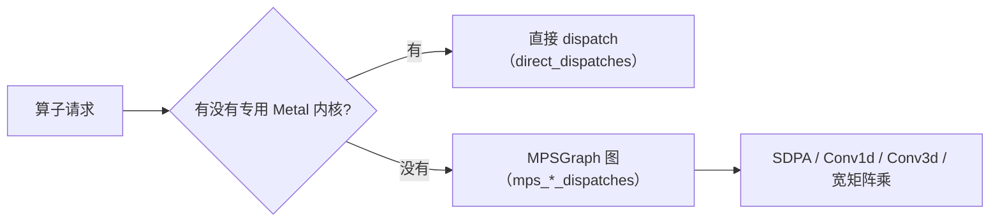

# Metal 内核库

`h3_shaders.metal`（4471 行）是引擎自有的 Metal 内核集合。它**作为源码字符串在运行时编译**（`h3_gpu_create` 接收 `shader_source_path`），因此不依赖 Xcode 的可选离线 Metal 工具链。

## 组织方式

内核按所属模型分族，命名统一为 `h3_<算子>_<dtype>[_<特化>]`：

| 族 | 代表内核 | 行 |
|---|---|---:|
| F32 通用 | `h3_linear_f32`、`h3_silu_f32`、`h3_rms_norm_f32`、`h3_layer_norm_f32` | 150–390 |
| F32 结构 | `h3_adaln_f32`、`h3_gate_f32`、`h3_qkv_rope_f32`、`h3_swiglu_f32` | 391–587 |
| 视觉 VAE | `h3_vae_encoder_pad_f32`、`h3_vae_encoder_group_norm_silu_f32` | 588–701 |
| 音频 | `h3_weight_norm_f32`、`h3_alias_free_snake_f32`、`h3_snake1d_f32`、`h3_audio_qkv_split_f32`、`h3_audio_attention_pool_f32`、`h3_geglu_f32` | 702–878 |
| BF16 基础 | `h3_linear_bf16` | 879 |
| Metal 4 / TensorOps | `h3_linear_bf16_nax_r128[_morton(4)]`、`h3_qkv_project_split_bf16_nax_r128_morton4`、`h3_qk_rope_bf16_nax_inplace` | 1014–1227 |
| NAX MLP | `h3_fc1_swiglu_bf16_nax_r128[_morton(4)]` | 1228–1410 |
| int8 量化 | `h3_quantize_bf16_int8_rows`、`h3_quantize_bf16_int8_groups[_scalar(128)(_cached)]`、`h3_quantize_bf16_int8_head_major_to_rows_cached` | 1411–1778 |
| int8 投影 | `h3_qkv_project_split_int8*_nax_r128_morton4`、`h3_fc1_swiglu_int8*_nax_r128`、`h3_linear_int8_nax_r128*` | 1779–2600+ |
| 权重处理 | `h3_weight_dequant_unrotate_int8`、`h3_convrot_remap_qkv_bf16` | 83–149 |

Sources: [h3_shaders.metal](h3_shaders.metal#L83-L2600)

## 模板特化

很多内核用 C++ 模板 + `[[host_name]]` 把形状常量**编译进内核**，避开运行时分支：

```metal
template<uint K_TILE>
kernel void h3_qkv_project_split_int8_rope_nax_r128_morton4_impl(...) { ... }

template [[host_name("h3_qkv_project_split_int8_rope_nax_r128_morton4")]]
kernel h3_qkv_project_split_int8_rope_nax_r128_morton4_t<...>;
template [[host_name("h3_qkv_project_split_int8_rope_nax_r128_k5376_morton4")]]
kernel h3_qkv_project_split_int8_rope_nax_r128_morton4_t<...>;
```

同一个实现以多个 host name 暴露，C 侧按形状挑名字。典型特化维度：

- `K_TILE`：K 方向瓦片大小
- `k5376` / `full_k14336`：把 H3 的真实维度（5376、14336）编译进去
- `local_scales`：scale 是否缓存在 threadgroup

Sources: [h3_shaders.metal](h3_shaders.metal#L1845-L1850), [h3_shaders.metal](h3_shaders.metal#L2023-L2028), [h3_shaders.metal](h3_shaders.metal#L2229-L2352)

## Morton 调度

Metal 4 / TensorOps 路径用 **Morton 序调度**把 Q/K/V 直接写进 head-major 的注意力输入布局：

- 省掉 MPSGraph 的三次输入转置
- 与可移植路径**逐字节一致**
- 2049–3072 行（含 864×480）用两次行偏移 Morton dispatch 保持高效瓦片几何

完整的 512×512 50 块 forward 提升约 2%。

Sources: [README.md](README.md#L626-L633), [h3_shaders.metal](h3_shaders.metal#L1037-L1149)

## 与 MPSGraph 的分工



MPSGraph 承担**稳定但形状多变**的算子（SDPA、卷积、超宽矩阵乘），自研内核承担**H3 特有、形状固定、值得特化**的算子（AdaLN、门控、QKV+RoPE、patch 投影、量化）。

`h3_gpu_stats` 分别统计 `direct_dispatches` 与 `mps_linear/conv/sdpa_dispatches`，因此一次运行的算子构成是可观测的。

Sources: [h3_gpu.h](h3_gpu.h#L17-L33)

## 稳定算子的图缓存

不可变的 DiT 权重与偏置的 **MPSGraph tensor-data 包装器会被保留**，连同其常驻缓冲一起。这避免为每个块、每次去噪求值重建相同的绑定元数据，且不拷贝张量存储。

**激活包装器保持瞬态**——保留它们在 M5 上是回退的。

ABBA 实测收益：M3 Max 1.6%，M5 Max 0.4–1.1%。输出逐字节一致。

回退：`H3_DISABLE_GRAPH_DATA_CACHE=1`

Sources: [README.md](README.md#L698-L704)

## MPSCommandBuffer 复用

M3 / 更老硬件上，每个 DiT 块里的四个 MPSGraph 段**复用一个 `MPSCommandBuffer` 包装器**（共享底层 Metal 命令缓冲）。

M5 实测中性，因此保留新建包装器。

- 热平衡重复实测 M3 Max 快 1.0–1.6%
- 结果逐字节一致
- `H3_REUSE_MPS_COMMAND=0` / `1` 覆盖自动选择

Sources: [README.md](README.md#L705-L709)

## 常量直写内核

H3 的真实维度被**直接编译进内核**：

- `h3_fc1_swiglu_int8_nax_r128_k5376` → K=5376
- `h3_linear_int8_nax_r128_full_k14336` → 完整 K=14336
- `h3_qkv_project_split_int8_rope_nax_r128_k5376_morton4`

代价是编译时间，收益是循环边界在编译期已知、可完全展开。FC1 的 H3 特化 5376 宽 TensorOps 循环与通用循环逐字节一致，但快 0.1–0.4%。

Sources: [h3_shaders.metal](h3_shaders.metal#L2341-L2352), [h3_shaders.metal](h3_shaders.metal#L2490-L2543), [README.md](README.md#L854-L856)

## 运行时编译的取舍

| 优点 | 代价 |
|---|---|
| 不需要 Xcode 完整 Metal 工具链 | 首次运行有编译开销 |
| 内核形状可按实际参数特化 | 编译失败需静默回退到可移植库 |
| 跟随 Iris 的既有做法 | — |

`H3_NAX=0` 可完全禁用 TensorOps 做精确 A/B 诊断。

Sources: [README.md](README.md#L459-L467), [README.md](README.md#L634-L636)
