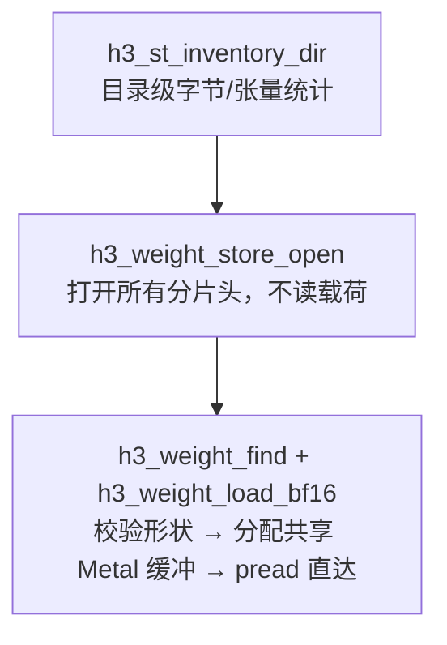

# 模型加载与检查点布局

加载分三层：**目录校验 → safetensors 头解析 → 按需惰性映射张量**。`h3_load_dir` 只做前两层，第三层散落在各子系统的 `load_*` 里。

## 目录布局

```
MiniMax-H3/
├── FL2VA/
│   ├── transformer/config.json          # 必需
│   │              model.safetensors.index.json
│   │              model-000NN-of-000NN.safetensors
│   ├── tokenizer/tokenizer.json         # 必需
│   ├── text_encoder/                    # 可选（ClipProj 激活时）
│   ├── video_vae/source/                # 必需
│   └── audio_vae/                       # 必需
└── Ref2VA/
    ├── transformer/                     # 可选，仅有序参考需要
    ├── tokenizer/tokenizer.json
    ├── text_encoder/ video_vae/source/ audio_vae/
```

`h3_load_dir` 用 `h3_require_file` 与 `h3_inventory` 逐项校验，任一项失败即把 `ctx->error` 复制到全局错误缓冲后释放上下文。

Sources: [h3.c](h3.c#L425-L433), [h3.c](h3.c#L370-L406)

## 三层加载 API



| 层 | 文件 | 职责 |
|---|---|---|
| 原始 safetensors | `h3_safetensors.c` | 解析 JSON 头、按名查找、按偏移读数据、目录清单统计 |
| 权重存储 | `h3_weights.c` | 打开一个组件目录下所有分片，按名定位，加载并校验 dtype/形状 |
| 设备映射 | `h3_gpu.m` | 分配共享 Metal 缓冲，把文件字节 `pread` 进去 |

`h3_weight_load_bf16` 的关键性质：**校验精确的 BF16 形状后直接把 payload 读进共享 Metal 缓冲，中间不产生任何 host 分配**。这对 33B 的 DiT 是决定性的。

Sources: [h3_safetensors.h](h3_safetensors.h#L44-L56), [h3_weights.c](h3_weights.c#L44-L132), [h3_weights.c](h3_weights.c#L436-L457)

## 组件清单

```c
typedef struct {
    uint64_t bytes;          /* 组件总字节 */
    uint64_t tensor_bytes;   /* 张量载荷字节 */
    size_t files;            /* 分片数 */
    size_t tensors;          /* 张量数 */
} h3_component_info;
```

`h3_model_info` 持有五个组件的清单（text_encoder、fl2va_transformer、ref2va_transformer、video_vae、audio_vae）。这份清单是 [自动内存规划](memory-plan) 的唯一输入——规划器不加载任何权重就能估算驻留开销。

Sources: [h3.h](h3.h#L168-L181), [h3_safetensors.h](h3_safetensors.h#L54-L56)

## 与发布 checkpoint 的两处关键差异

### 1. QKV 行是交错布局

发布的 checkpoint 把 DiT QKV 存成 **`[head, q/k/v, dimension]`**，而非常规的 `[q/k/v, head, dimension]`。早期按恒等解释去读，得到的正是一堆噪声诊断输出。

现在原生 Metal 在**融合的 QK-norm / RoPE 内核**里直接消费这个布局，省掉一次 checkpoint 转置和额外 RAM。`h3_gpu.h` 明确区分了两个入口：

- `h3_gpu_qkv_rope_bf16` —— 常规 `[q/k/v, head, dim]`
- `h3_gpu_grouped_qkv_rope_bf16` —— H3 的 `[head, q/k/v, dim]`

Sources: [h3_gpu.h](h3_gpu.h#L454-L465), [README.md](README.md#L721-L726)

### 2. 权重存储形态不止 BF16

`h3_weights.c` 支持三条载入路径，由环境决定：

| 路径 | 条件 | 说明 |
|---|---|---|
| 纯 BF16 | 默认 | pread 直达共享缓冲 |
| M5 zero-copy | M5 级 GPU | 直接从 safetensors 分片 `mmap` 持久权重，保持文件背衬/可回收 |
| ConvRot int8 | `H3_CONVROT_*` | 读 int8 + scale，用 Walsh-Hadamard 反旋转还原成真 BF16 权重 |

M5 上持久变换器权重直接从分片映射而非拷进匿名共享缓冲，让 37 GiB 模型保持文件背衬，且略微改善总变换器时间；M3 走更快的拷贝缓冲路径。`H3_ZERO_COPY_WEIGHTS=0` 可关闭 M5 的选择。

Sources: [h3_weights.c](h3_weights.c#L160-L206), [README.md](README.md#L600-L612)

## 设备探测

`h3_metal_probe`（唯一的 `.m` 探针）填充 `h3_device_info`：

- `recommended_working_set` ← `device.recommendedMaxWorkingSetSize`
- `max_buffer_length` ← `device.maxBufferLength`
- `apple_gpu_family` ← 从 family 10 递减试探 `supportsFamily:`
- `metal4` ← `supportsFamily:MTLGPUFamilyMetal4`（需 macOS 26+）

Sources: [h3_metal.m](h3_metal.m#L15-L47)

## 加载顺序即内存策略

各阶段按需加载、用完即弃，是让 33B 模型在单机可跑的核心手段。`h3.c` 在 DiT 加载完成后立刻释放文本嵌入与条件行，在音频解码后立刻释放音频潜变量。详见 [自动内存规划](memory-plan) 与 [SSD 流式权重](ssd-streaming)。

Sources: [h3.c](h3.c#L1628-L1633), [h3.c](h3.c#L1697-L1699)
