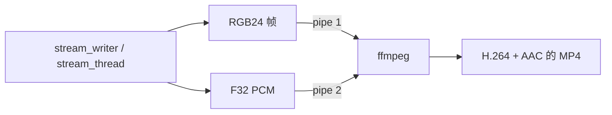

# 封装输出与超分后处理

`h3_ffmpeg.c`（919 行）是引擎与外界的媒体边界。它**不链接 libav**，而是把 ffmpeg 当作子进程，通过管道喂数据。

## 职责一览

| 类别 | 函数 |
|---|---|
| 探测 | `h3_ffprobe_visual_size` |
| 解码输入 | `h3_ffmpeg_read_image_f32`、`h3_ffmpeg_read_video_f32`、`h3_ffmpeg_read_audio_f32` |
| 编码输出 | `h3_ffmpeg_write_rgb24`、`h3_ffmpeg_write_av_rgb24_f32` |
| 后处理 | `h3_superres` |

可执行文件可被环境变量覆盖：

```c
static const char *ffmpeg_program(void);   /* H3_FFMPEG  */
static const char *ffprobe_program(void);  /* H3_FFPROBE */
```

Sources: [h3_ffmpeg.c](h3_ffmpeg.c#L16-L26), [h3_ffmpeg.h](h3_ffmpeg.h#L12-L58)

## 输入侧

### 图像

```c
int h3_ffmpeg_read_image_f32(const char *path, int width, int height,
                             h3_image_fit fit, float **pixels,
                             char *error, size_t error_size);
```

产出通道优先 F32 `[3,height,width]`，值域 `[0,1]`。两种拟合：

| 拟合 | 语义 | 使用者 |
|---|---|---|
| `H3_IMAGE_FIT_STRETCH` | 拉伸到目标画布 | 首帧锚点、Ref2VA 参考图像 |
| `H3_IMAGE_FIT_COVER` | 比例覆盖后居中裁剪 | 末帧锚点 |

Sources: [h3_ffmpeg.h](h3_ffmpeg.h#L7-L21), [h3.c](h3.c#L1298-L1315)

### 视频

按 24 fps 解码成 `[3,T,H,W]`，**帧数向下裁剪到发布的 `5+17k` 节拍**。

Sources: [h3_ffmpeg.h](h3_ffmpeg.h#L23-L27)

### 音频

解码首个音频流为 **32 kHz 立体声 F32**，通道优先。`max_samples` 限制分配上限。

`truncate_at_limit` 是一个语义开关：

- `= 1`（视频音轨）：到上限就静默截断
- `= 0`（独立音频片段）：到上限**报错**而不是悄悄裁剪

Sources: [h3_ffmpeg.h](h3_ffmpeg.h#L29-L35), [h3.c](h3.c#L1225-L1231)

## 输出侧：双并发管道

```c
int h3_ffmpeg_write_av_rgb24_f32(const char *path, const uint8_t *frames,
                                 int frame_count, int width, int height,
                                 int fps, const float *pcm, int samples,
                                 int channels, int sample_rate,
                                 char *error, size_t error_size);
```



两个 `stream_writer` 各由一个 `stream_thread`（`h3_ffmpeg.c:587`）驱动并发写入，**不产生任何中间未压缩媒体文件**。这是 `make_parents`（36）会先建目录、`write_all`（57）处理短写的原因。

Sources: [h3_ffmpeg.c](h3_ffmpeg.c#L580-L614), [h3_ffmpeg.c](h3_ffmpeg.c#L36-L75)

## 超分后处理

`h3_superres`（`h3_ffmpeg.c:785`）调用外部 `realesrgan-ncnn-vulkan`：


### 参数

| CLI | 语义 |
|---|---|
| `--sr` | 启用 |
| `--sr-bin DIR` | 含 `realesrgan-ncnn-vulkan` 的目录 |
| `--sr-model-dir DIR` | 含 `.bin` / `.param` 的目录 |
| `--sr-model NAME` | 默认 `realesrgan-x4plus` |
| `--sr-target WxH` | 明确目标分辨率；缺省为内部尺寸 × scale |
| `--sr-scale N` | 2 / 3 / 4，默认 4；无 `--sr-target` 时生效 |

### 分辨率策略

内部（超分前）分辨率从输出文件**自动探测**，即视频实际生成的 `--width × --height`。

- `--sr-target` 是内部尺寸的 2–4 整数倍 → 模型按该精确倍率跑
- 否则 → 按 ×4 跑，最后用 ffmpeg 缩到请求的目标

### 失败语义

**这是对已编码视频的后处理，不是扩散流水线的一部分**。失败时回退到低分辨率片段，而不是中断整次运行。

Sources: [h3_ffmpeg.h](h3_ffmpeg.h#L49-L58), [README.md](README.md#L357-L402)

## 推荐的低分辨率 + 超分组合

内部画布必须是 32 的倍数（见 [序列布局与位置编码](layout-and-rope)）并与目标成比例。16:9 输出下，`512x288`（×4 → `2048x1152`，再缩到 `1280x720`）是安全且快的选择：

```sh
./h3 -d ./MiniMax-H3 -p "..." --seconds 15 \
     --width 512 --height 288 \
     --steps 4 --layers 45 --reuse 1 --ssd-streaming \
     --sr --sr-bin /tmp/h3_realesrgan --sr-model-dir /tmp/h3_realesrgan/models \
     --sr-target 1280x720 -o outputs/drama-720p.mp4
```

最快的生成预设（`--steps 4 --layers 45 --reuse 1 --ssd-streaming`）把扩散成本压到最低，视觉重活交给 ×4 放大。

Sources: [README.md](README.md#L389-L402)

## 无 MP4 的运行

`-o ''` 关闭 MP4 编码。配合 `--frames-dir DIR` 把最终帧写成 PPM，可在 ffmpeg 不可用时仍能产出画面。注意 `--show` 的中间预览**不会**写进 `--frames-dir`。

Sources: [README.md](README.md#L341-L344)
