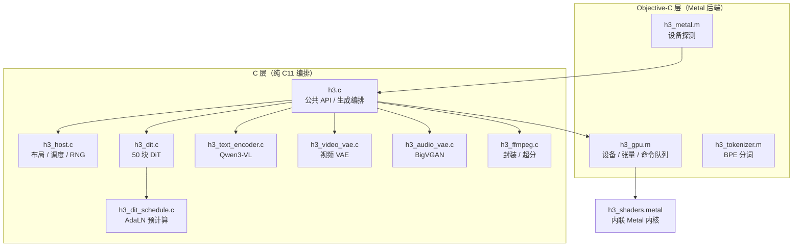

# h3-metal 项目总览

`h3.c` 是一个 **纯 C / Objective-C 实现的 MiniMax-H3 本地推理引擎**，仅面向 macOS / Apple Silicon。它在 Metal 上重新实现了 H3 的 FL2VA（文生视频+音频）与 Ref2VA（参考生视频+音频）扩散流水线，**不依赖 Python、torch 或任何外部 ML 运行时**。CLI 可执行文件是 `h3`，可嵌入的静态库是 `libh3.a`。

## 一句话架构

C 负责编排，Objective-C 负责 Metal 后端。跨模块数据类型集中在 `h3_internal.h`，对外只暴露 `h3.h`。



Sources: [h3_internal.h](h3_internal.h#L12-L34), [h3.h](h3.h#L1-L30), [Makefile](Makefile#L11-L16)

## 关键事实

| 维度 | 值 | 来源 |
|---|---|---|
| 版本 | `0.1.0-dev` | `H3_VERSION` |
| 默认画布 | 864x480，56 帧，24 fps | `H3_DEFAULT_*` |
| 画布约束 | 宽高均为 32 的倍数，乘积 ≤ `768*1344` | `H3_CANVAS_MULTIPLE` / `H3_MAX_PIXELS` |
| 帧对齐 | 向上对齐到 `5 + 17*n`（22..362） | `h3_align_frame_count` |
| DiT 规模 | 50 块，HIDDEN=5376，HEADS=56，MLP=14336 | `h3_dit.c` 枚举 / `h3_dit_schedule.h` |
| 潜变量 | 视频 24 通道（空间比 16），音频 32 通道 x 2 立体声 | `H3_VAE_SPATIAL_RATIO` / `h3_audio_vae.h` |
| 音频 | 32 kHz 立体声，音频潜变量 40 fps | `H3_AUDIO_LATENT_FPS` |

Sources: [h3.h](h3.h#L12-L18), [h3_host.h](h3_host.h#L7-L14), [h3_dit_schedule.h](h3_dit_schedule.h#L11-L15)

## 两条并行的权重大流

引擎同时消费两组权重，它们在时间上**从不需要共存**：

1. **文本 / 视觉编码器流**：Qwen3-VL 前 50 层 + 视觉塔，负责把 prompt 与参考图像/视频/音频编码为 BF16 条件嵌入。Ref2VA 复用同一套。
2. **DiT + VAE 流**：33B DiT 变换器、视频 VAE（36 块解码器）、音频 VAE（BigVGAN）。

`h3.c` 按阶段分别加载与释放，因此 33B 变换器、Qwen 编码器和两个解码器**永远不必同时驻留统一内存**——这是本机可运行的根本原因。

Sources: [h3.c](h3.c#L408-L484), [h3.c](h3.c#L1628-L1633)

## 两条生成路径

| 路径 | 触发条件 | 检查点 | 说明 |
|---|---|---|---|
| **FL2VA** | 纯文本，或 `--first-frame` / `--last-frame` 锚点 | `FL2VA/transformer` | 首帧拉伸到目标画布，末帧按 aspect-cover 居中裁剪 |
| **Ref2VA** | 存在有序参考（`--ref-image` / `--ref-video` / `--ref-audio`） | `Ref2VA/transformer` | 保留 `<Picture N>` / `<Video N>` 有序呈现，参考画布只缩不放 |

Sources: [h3.c](h3.c#L938-L942), [h3.c](h3.c#L993-L1002)

## 上下文对象

`h3_ctx` 是整个引擎的唯一句柄，持有模型目录、设备信息、模型清单，以及交互会话的三层缓存（条件、准备好的 DiT、视频解码器）：

```c
struct h3_ctx {
    char *model_dir;
    char error[512];
    h3_device_info device;
    h3_model_info model;
    int cache_enabled;
    /* 条件缓存：BF16 值 + 标签 + 视觉/音频条件行 */
    char *conditioning_key;
    uint16_t *conditioning_values;
    /* 准备好的 DiT 与视频解码器缓存 */
    char *dit_key;              struct h3_dit *dit;
    char *video_decoder_key;    struct h3_video_vae_decoder *video_decoder;
};
```

Sources: [h3_internal.h](h3_internal.h#L12-L34)

## 推荐阅读顺序

1. [构建与运行](build-and-run) —— 先把二进制跑起来
2. [六阶段流水线](pipeline-overview) —— 理解一次生成的全貌
3. [公共 API（h3.h）](public-api) —— 参数与回调契约
4. [模型加载与检查点布局](model-loading) —— 权重从哪来
5. [DiT 去噪与采样器](dit-denoise) —— 最耗时的核心
6. [GPU 抽象层（h3_gpu）](gpu-abstraction) / [Metal 内核库](metal-shaders) —— 底层是怎么算的
7. [自动内存规划](memory-plan) / [SSD 流式权重](ssd-streaming) —— 为什么小内存机器也能跑
8. [性能分析与诊断开关](profiling) —— 如何做 A/B 与回归定位

## 文档之外的权威来源

仓库根目录的 `README.md`（878 行）是**教程与实测数据**的一手来源：预设档位、分辨率/时长表、每项融合优化的实测收益与对应的 `--use-slower-*` 回退开关都在那里。`AGENTS.md` 则是构建注意事项与架构速览。本 Wiki 是对源码结构的补充，不是它们的替代品。

Sources: [README.md](README.md#L1-L11), [AGENTS.md](AGENTS.md#L1-L12)
