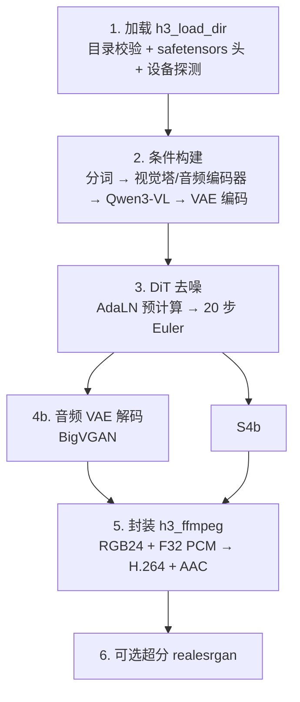
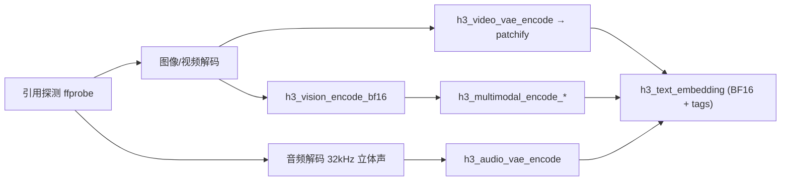
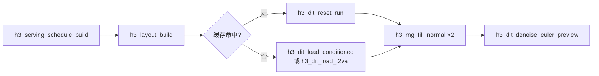

# 六阶段流水线

一次 `h3_generate()` 调用是一条**严格分阶段的直线流水线**。每个阶段在结束时会释放自己独有的大张量，因此峰值统一内存由**单个阶段的最大值**决定，而不是各阶段之和。



## 阶段 0：参数生效与自动规划

`h3_generate` 开头先对 `params` 做一份**有效副本** `eff`，在副本上运行 [自动内存规划](memory-plan)，再对副本做校验。这样调用方传入的 `params` 不被修改，而后续所有代码只用 `params = &eff`。

规划只在 `memory_plan_auto` 为真**且**用户没有显式指定 `ssd_streaming` / `use_int8_row_fc2` 时生效。

Sources: [h3.c](h3.c#L882-L928)

## 阶段 1：加载

`h3_load_dir` 只做三件事：必需文件存在性检查、目录级的 safetensors 清单统计（`h3_st_inventory_dir`）、Metal 设备探测。**不读取任何张量载荷**。

必需：`FL2VA/transformer/config.json`、`FL2VA/tokenizer/tokenizer.json`，以及 `FL2VA/transformer`、`FL2VA/video_vae/source`、`FL2VA/audio_vae` 三个目录。

`FL2VA/text_encoder` 在 ClipProj 路径激活时是**可选的**（`H3_CLIPPROJ_DIR` 指向有效目录即可）；`Ref2VA/` 整棵是可选的，仅在有序参考请求时才需要。

Sources: [h3.c](h3.c#L408-L484)

## 阶段 2：条件构建

这是分支最多的一段，详见 [条件构建与多模态编码](conditioning)。概括：



产出物是三样：`h3_text_embedding text`（BF16 值 + 每行的 DiT 模态 tag）、`condition_video_rows`（宽度 96 的 F32 行）、`condition_audio_rows`（宽度 32 的 F32 行）。

Sources: [h3.c](h3.c#L1098-L1295), [h3.c](h3.c#L1467-L1519)

## 阶段 3：DiT 去噪



注意**视频与音频各自用独立 RNG 但同一个种子**，这与发布版服务端一致。

去噪开始前，`text` 与条件行就被释放了（`h3.c:1628-1632`）——DiT 已经把条件烘焙进自己的 resident 张量。

Sources: [h3.c](h3.c#L1542-L1633), [h3.c](h3.c#L1665-L1686)

## 阶段 4：解码

音频先解（较快，且能提前失败），视频后解。两条路径：

- 若已加载常驻解码器（预览模式或缓存命中）→ `h3_video_vae_decoder_decode`
- 否则 → 一次性的 `h3_video_vae_decode`

帧数不足输出画布时，用 vImage 高质量重采样放大到请求的输出尺寸。

Sources: [h3.c](h3.c#L1690-L1751)

## 阶段 5/6：交付与封装

先通过 `on_frame` 逐帧交付（可取消），再调用 `h3_ffmpeg_write_av_rgb24_f32` 通过**两条并发管道**送入 ffmpeg，不产生任何中间未压缩媒体文件。最后可选做 Real-ESRGAN 超分。

Sources: [h3.c](h3.c#L1752-L1776)

## 统一的错误与取消出口

整个 `h3_generate` 是**单一 `cleanup:` 出口**的写法：所有资源在入口处初始化为 NULL/0，任何失败都 `goto cleanup`，出口处统一释放。缓存命中的 DiT / 解码器用 `dit_is_cached` / `decoder_is_cached` 标志排除在释放之外——这是缓存能跨调用存活的关键。

```c
cleanup:
    ...
    if (!dit_is_cached) h3_dit_free(dit);
    if (!decoder_is_cached) h3_video_vae_decoder_free(preview_decoder);
    return result;
```

Sources: [h3.c](h3.c#L1789-L1824)
