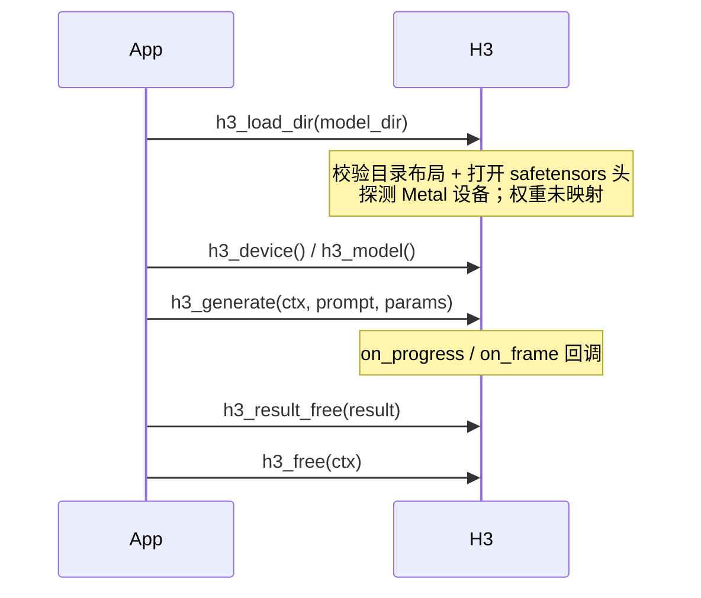

# 公共 API（h3.h）

`h3.h` 是整个引擎的对外契约：一个不透明上下文、一组扁平的 C 函数、一个参数结构体。所有内部实现（DiT、VAE、编码器）都通过它间接触达。

## 生命周期



| 函数 | 语义 |
|---|---|
| `h3_load_dir` | 校验模型目录布局，解析 `h3_model_info`，并通过 `h3_metal_probe` 探测设备。**权重保持未映射**。 |
| `h3_free` | 清空缓存并释放上下文 |
| `h3_last_error` | 返回最后一次错误字符串（ctx 为 NULL 时读全局） |
| `h3_device` / `h3_model` | 读取设备信息与组件清单 |
| `h3_generate` | 执行一次完整生成，帧通过 `on_frame` 增量交付 |
| `h3_cache_set_enabled` / `h3_cache_clear` / `h3_cache_get_info` | 交互会话的跨调用复用开关，默认关闭 |

Sources: [h3.h](h3.h#L192-L213)

## h3_params：生成参数

参数结构体是**扁平的、全 int / 指针**，没有嵌套配置对象。默认值由 `H3_PARAMS_DEFAULT` 宏给出。

| 字段 | 默认 | 含义 |
|---|---:|---|
| `width` / `height` | 864 / 480 | 输出画布，均为 32 的倍数，乘积 ≤ `768*1344` |
| `frames` / `steps` | 56 / 20 | 请求帧数（对齐到 `5+17n`）、去噪步数 |
| `seed` | 42 | 本机随机流种子 |
| `denoise_reuse` | 1 | 每 N 步评估一次完整 DiT：1 精确、2 快速、3 激进 |
| `dit_layers` | 50 | 按 AdaLN 门控排序后保留的块数，取值 `[35,50]` |
| `core_reuse` | 1 | 每 N 步重算变换器核心，同时每步刷新时间步头；与 `denoise_reuse` **互斥** |
| `token_reduction` | 0 | 在中段块内成对合并水平视频 token（激进加速，可选） |
| `ssd_streaming` | 0 | 只保留 2 个 BF16 DiT 块，与 GPU 执行重叠从 SSD 读下一块 |
| `use_int8_row_fc2` | 0 | 每个 FC2 行一个激活 scale 的 int8；需要 Metal 4 |
| `use_reference_rope` | 0 | 在 256x256 恢复发布版空间 RoPE（默认用半尺度自适应网格） |
| `lora_path` | NULL | 加载时合并进 DiT 权重的 Turbo/distillation LoRA |
| `render_width` / `render_height` | 0 | 更低的内部模型画布，同比例、不超过输出尺寸 |
| `memory_plan_auto` | 1 | 依据设备工作集自动选 ssd_streaming / int8 / dit_layers |
| `preview_denoise` | 0 | 每个 Euler 步后解码一帧预览（**需要 `on_frame`**） |
| `use_slower_*` | 0 | 一组**回退开关**，强制走可对照的慢路径 |

Sources: [h3.h](h3.h#L65-L155)

### 参数互斥关系（在 `h3_valid_params` 中强制）

```
ssd_streaming        ⊕ use_int8_row_fc2        （流式用原始 BF16）
use_int8_row_fc2     ⊕ use_slower_bf16_mlp
use_int8_row_fc2     → 需要 device.metal4
core_reuse > 1       ⊕ denoise_reuse > 1
references           ⊕ first_frame / last_frame
preview_denoise      → 需要 on_frame
```

参考数量上限：**12 个总引用**，其中 **9 图 / 3 视频 / 3 音频**；纯音频引用必须搭配图像或视频引用。

Sources: [h3.c](h3.c#L577-L601), [h3.c](h3.c#L651-L658)

## 回调

```c
typedef int (*h3_frame_callback)(const h3_frame *frame, void *opaque);
typedef int (*h3_progress_callback)(const char *phase, int completed,
                                    int total, void *opaque);
```

两者**返回非零即表示取消**，引擎会回滚到 `cleanup` 并设置 "generation cancelled ..." 错误。

`h3_frame` 的 `denoise_step` 为非负值时表示这是一帧**中间去噪预览**；最终帧该字段为 `-1`。

进度 phase 字符串包括：`tokenizer`、`text encoder`、`Qwen vision`、`video VAE load`、`preview VAE load`、`video VAE encoder`、`audio VAE encoder`、`audio VAE`、`FFmpeg`，以及 DiT 透传的 phase。

Sources: [h3.h](h3.h#L49-L63), [h3.c](h3.c#L669-L710)

## 参考输入

```c
typedef enum {
    H3_REFERENCE_IMAGE = 1,        /* 一张图 */
    H3_REFERENCE_VIDEO = 2,        /* 视频，可选带内嵌音轨 */
    H3_REFERENCE_AUDIO = 3,        /* 独立音频片段 */
    H3_REFERENCE_VIDEO_AUDIO = 4   /* 视频 + 显式替换音轨 */
} h3_reference_kind;
```

`references` 数组的**顺序即呈现顺序**，对应 prompt 里的 `<Picture 1>`、`<Picture 2>`… 文件名对模型没有语义。

Sources: [h3.h](h3.h#L30-L47)

## 设备与模型信息

```c
typedef struct {
    char name[128]; char architecture[128];
    uint64_t physical_memory;
    uint64_t recommended_working_set;   /* 自动内存规划的输入 */
    uint64_t max_buffer_length;
    int apple_gpu_family; int metal4; int unified_memory;
} h3_device_info;

typedef struct {
    h3_component_info text_encoder, fl2va_transformer,
                      ref2va_transformer, video_vae, audio_vae;
} h3_model_info;
```

`recommended_working_set` 直接来自 `MTLDevice.recommendedMaxWorkingSetSize`，是 [自动内存规划](memory-plan) 的决策依据；`metal4` 由 `supportsFamily:MTLGPUFamilyMetal4` 决定，是 [int8 与 TensorOps 路径](int8-tensorops) 的准入条件。

Sources: [h3.h](h3.h#L157-L181), [h3_metal.m](h3_metal.m#L31-L44)
