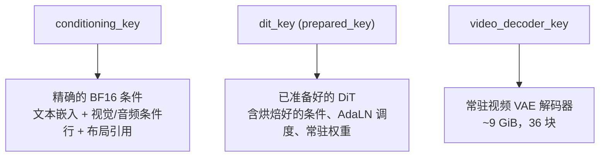
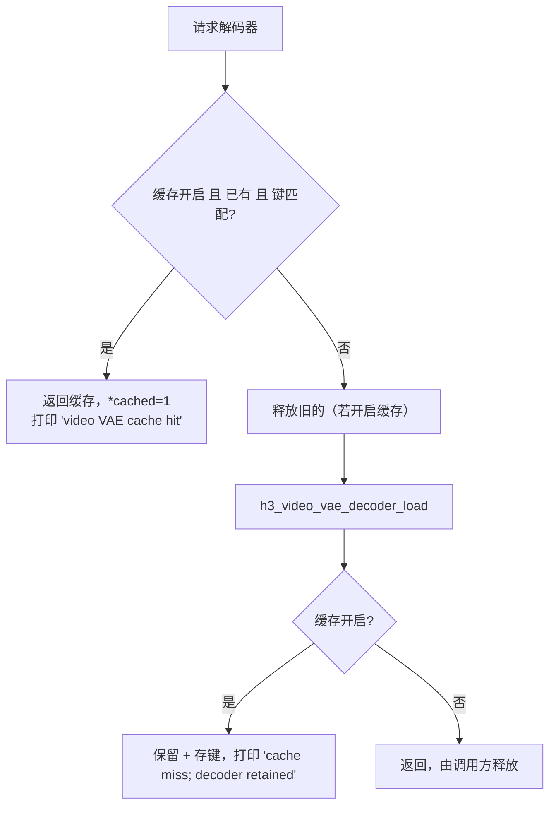

# 会话缓存与复用

交互会话的核心价值是**跨生成复用三层中间状态**。一次性调用方默认关闭缓存，保留原始的分阶段内存生命周期。

```c
void h3_cache_set_enabled(h3_ctx *ctx, int enabled);
void h3_cache_clear(h3_ctx *ctx);
void h3_cache_get_info(const h3_ctx *ctx, h3_cache_info *info);
```

Sources: [h3.h](h3.h#L200-L204)

## 三层缓存



| 层 | 键 | 内容 | 复用价值 |
|---|---|---|---|
| 条件 | `conditioning_key` | prompt + 参数 + 渲染尺寸 + 是否 ref2va | **避免重跑 Qwen 与视觉/音频编码器** |
| 准备好的 DiT | `prepared_key` | `conditioning_key` + 参数 + 渲染尺寸 | 避免重新加载与量化 33B 权重 |
| 视频解码器 | `decoder_key` | VAE 路径 + latent 尺寸 | 避免重新加载 9.7 GiB 解码器 |

Sources: [h3.c](h3.c#L140-L193), [h3.c](h3.c#L1008-L1026)

## 键的构造

```c
conditioning_key = h3_conditioning_key(prompt, params, render_width, render_height, ref2va);
prepared_key     = h3_prepared_key(conditioning_key, params, render_width, render_height);
decoder_key      = "vae_path|latent_hxlatent_w";
```

键是一次性分配的字符串（`h3_key_append` 做格式化累积），生成结束时统一释放。

Sources: [h3.c](h3.c#L92-L139), [h3.c](h3.c#L1008-L1026)

## 失效规则

**比较即失效**：任何一层在生成开始时先比键，不匹配就释放旧的。

```c
if (ctx->cache_enabled && ctx->dit &&
    (!ctx->dit_key || strcmp(ctx->dit_key, prepared_key))) {
    h3_dit_free(ctx->dit);
    ctx->dit = NULL;
    free(ctx->dit_key);
    ctx->dit_key = NULL;
}
```

因此改 `--steps`、改 `--layers`、改渲染尺寸都会让 DiT 缓存失效（这些参数进 `prepared_key`），但**不改 `conditioning_key`**——条件层仍可复用。

Sources: [h3.c](h3.c#L1027-L1040)

## DiT 复用的正确姿势

命中 DiT 缓存时，不能直接重跑——必须调用 `h3_dit_reset_run` 重置可变的采样器状态并替换依赖种子的条件行：

```c
if (ctx->cache_enabled && ctx->dit && ctx->dit_key &&
    !strcmp(ctx->dit_key, prepared_key)) {
    dit = ctx->dit;
    dit_is_cached = 1;
    if (!h3_dit_reset_run(dit, condition_video_rows, condition_video_elements,
                          condition_audio_rows, condition_audio_elements,
                          detail, sizeof(detail))) { ... }
}
```

**这就是为什么种子可以变而 DiT 不必重建**：种子只影响条件行的噪声注入（0.999 增强里的那 0.001）与初始噪声，二者都在 `reset_run` 与 `h3_rng_fill_normal` 里处理。

Sources: [h3.c](h3.c#L1558-L1569), [h3_dit.h](h3_dit.h#L82-L89)

## 条件缓存的内容

```c
h3_conditioning_cache_store(ctx, conditioning_key, &text,
                            condition_video_rows, condition_video_elements,
                            condition_audio_rows, condition_audio_elements,
                            layout_references, reference_count, conditioned);
```

存的是**精确的 BF16 值**（stderr 会打印 `conditioning cache miss; stored exact BF16`），不是重算的中间量。加载时还要校验缓存的引用数与当前请求一致。

Sources: [h3.c](h3.c#L220-L270), [h3.c](h3.c#L1044-L1053)

## 视频解码器的获取

`h3_acquire_video_decoder`（712）封装了获取逻辑：



Sources: [h3.c](h3.c#L712-L745)

## 单一出口与缓存存活

整个 `h3_generate` 只有一个 `cleanup:` 出口，缓存能否跨调用存活取决于两个标志：

```c
if (!dit_is_cached) h3_dit_free(dit);
if (!decoder_is_cached) h3_video_vae_decoder_free(preview_decoder);
```

`dit_is_cached` 还会因为**去噪失败而被主动清零**——失败的 DiT 状态不应被复用：

```c
if (!h3_dit_denoise_euler_preview(...)) {
    if (!live_preview.failed) h3_set_error(ctx, "%s", detail);
    if (dit_is_cached) {
        ctx->dit = NULL;
        free(ctx->dit_key);
        ctx->dit_key = NULL;
        dit_is_cached = 0;
    }
    goto cleanup;
}
```

Sources: [h3.c](h3.c#L1679-L1687), [h3.c](h3.c#L1818-L1819)

## 默认关闭

头部注释说明：

> 交互会话复用。**默认关闭**，因此一次性调用方保留原始的分阶段内存生命周期。

`h3_cli.c` 在启动会话时打开它。会话内的 `!cache` 查看状态、`!cache clear` 清空。

Sources: [h3.h](h3.h#L200-L204), [h3_cli.c](h3_cli.c#L187-L188)

## 缓存信息的读取

```c
typedef struct {
    size_t embedding_entries;   /* 缓存的条件行数 */
    size_t embedding_bytes;     /* 缓存的字节数 */
    int prepared_dit;           /* 是否有已准备好的 DiT */
    int video_decoder;          /* 是否有常驻视频解码器 */
} h3_cache_info;
```

Sources: [h3.h](h3.h#L23-L28), [h3.c](h3.c#L73-L77)
