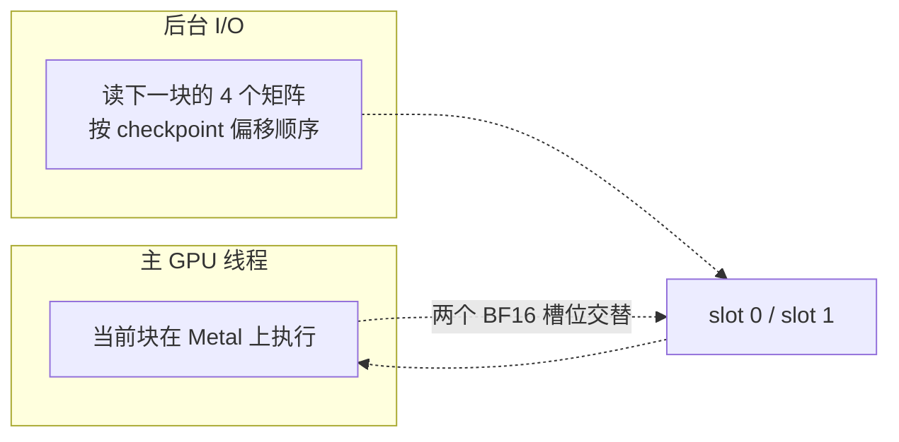

# SSD 流式权重

`--ssd-streaming` 是 DiT 的**独立激进驻留模式**：只用原始 BF16 checkpoint，不做转换或量化，把 DiT 的常驻存储从 ~36.5 GiB 压到 ~2 GiB。

Sources: [README.md](README.md#L131-L158)

## 机制



| 要素 | 说明 |
|---|---|
| 常驻 | 只有每块的小归一化权重 |
| 槽位 | **两个完整的 BF16 矩阵槽位交替** |
| 读取 | 后台读线程按 checkpoint 偏移顺序填充下一个槽位 |
| 并发 | 当前 Metal 命令缓冲同时执行 |
| 缓存 | Darwin 的非缓存读避免在文件缓存里保留第二份拷贝 |
| 预热 | 在最后一个块执行期间**重新预取第一个活跃块**，使缓存的交互式 DiT 为下一次去噪求值做好准备 |

Sources: [README.md](README.md#L614-L622), [h3_dit.c](h3_dit.c#L957-L1030)

## 关键数据结构

```c
enum { STREAM_QKV, STREAM_OUT, STREAM_FC1, STREAM_FC2, STREAM_MATRICES };

typedef struct {
    const char *path;
    uint64_t file_offset;
    size_t elements;
    unsigned field;
    const char *scale_path;      /* ConvRot int8 才有 */
    uint64_t scale_offset;
    size_t scale_elements;
    char scale_name[64];
    uint32_t rows, columns;
} h3_dit_stream_source;

typedef struct {
    h3_dit_stream_source sources[STREAM_MATRICES];
} h3_dit_stream_layer;
```

每层的四个矩阵由 `prepare_stream_layer` 登记，然后**按文件偏移排序**——这样读线程是顺序 I/O 而非随机 I/O。

Sources: [h3_dit.c](h3_dit.c#L60-L83), [h3_dit.c](h3_dit.c#L957-L975)

## 槽位分配

`allocate_stream_slot` 分配四个 BF16 矩阵，外加（按需）int8 副本与 scale：

```c
slot->qkv = h3_gpu_tensor_new_bf16(gpu, INNER * 3 * HIDDEN);
slot->out = h3_gpu_tensor_new_bf16(gpu, HIDDEN * INNER);
slot->fc1 = h3_gpu_tensor_new_bf16(gpu, FFN * 2 * HIDDEN);
slot->fc2 = h3_gpu_tensor_new_bf16(gpu, HIDDEN * FFN);
/* int8_qkv / int8_attention_out / int8_mlp 各自再加 int8 + scales */
```

Sources: [h3_dit.c](h3_dit.c#L977-L1020)

## 读线程

`read_stream_layer_thread`（1183）驱动 `read_stream_layer`（1041）。注释明确了线程归属：

> ConvRot int8 权重在 CPU 上反量化与反旋转（此线程不发 GPU 命令）；这里的 GPU 工作只有下面 M5 流式块的 int8 重量化。

因此 `gpu_work` 标志决定是否调用 `h3_gpu_begin`。

`h3_dit_stream_job` 记录 `bytes` 与 `seconds`，供 `H3_PROFILE=1` 报告总字节数、读吞吐与未被 GPU 工作隐藏的读等待比例。

Sources: [h3_dit.c](h3_dit.c#L1031-L1187)

## 实测

| 指标 | 512×512 | 864×480 |
|---|---:|---:|
| DiT 跟踪存储 | 36.5 GiB → **2.0 GiB** | → **2.1 GiB** |
| 温热 50 块 forward | 1.35 s vs 2.49 s（**慢 84%**） | 2.14 s vs 2.68 s（**慢 26%**） |

这是与**同一条全驻留 BF16 路径**的对比，两次检查的结果**逐字节相同**。

读吞吐实测约 **13–14.6 GiB/s**（内置 SSD）。

Sources: [README.md](README.md#L142-L148), [README.md](README.md#L620-L622)

## 2 GiB 数字的含义

README 特意澄清：

> 2.0–2.1 GiB 是 DiT 的**跟踪张量存储**，不是系统总 RAM。提示词编码与两个 VAE 在**独立的阶段**运行，不会把各自的峰值叠加进去；操作系统、媒体缓冲与输出分辨率仍需余量。

`--show` 会保持一个预览 VAE 常驻并增加约 10 GiB，因此最低内存运行要**省略 `--show`**。

Sources: [README.md](README.md#L150-L154)

## 约束

| 约束 | 原因 |
|---|---|
| 不能与 `--use-int8-row-fc2` 组合 | 流式用原始 BF16 权重 |
| 不能与 `--lora` 组合 | 只有 2 个块槽位轮转覆盖，无法原地更新完整 BF16 权重 |
| 首块缓存被禁用 | 预取环假设每个块都被按序消费 |
| 不是默认档位 | 显式的内存/速度权衡 |

Sources: [h3.c](h3.c#L577-L581), [h3_lora.h](h3_lora.h#L26-L27), [README.md](README.md#L156-L158), [README.md](README.md#L577-L579)

## 交互会话

会话里用 `!ssd-streaming on` 切换，`!status` 会显示当前是 `SSD BF16` 还是 `resident`。

Sources: [h3_cli.c](h3_cli.c#L171-L171), [h3_cli.c](h3_cli.c#L208-L210)

## 视频 VAE 的流式

DiT 之外，**视频 VAE 解码器也有流式模式**（`video_vae_streaming`），但机制不同：不是双槽轮转，而是**每次载入一块、跑一块、释放一块**，把 ~9 GiB 降到 ~0.25 GiB。

它由 [自动内存规划](memory-plan) 在预算紧张时自动打开，也可手动指定。实现细节见 [视频 VAE 解码](video-vae)。

Sources: [h3_video_vae.c](h3_video_vae.c#L572-L622), [h3.h](h3.h#L103-L106)
