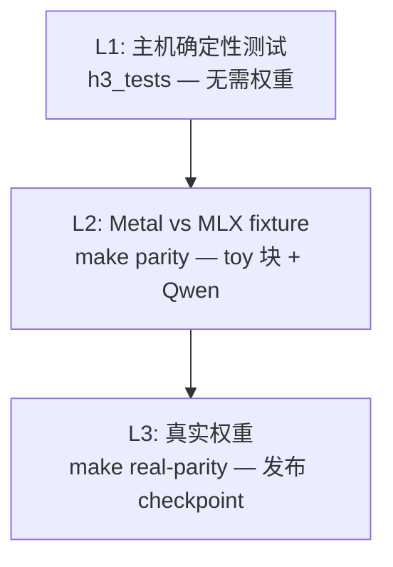

# 测试与数值对齐

测试是 `tests/` 下的**独立 `main()` 程序**，按用途命名。它们链接 `libh3.a` 的全部目标文件，因此能直接调用内部函数。

## 命名约定

| 前缀 | 含义 | 是否需要权重 |
|---|---|---|
| `test_*` | 确定性主机测试 / 需要 fixture 的 Metal 测试 | 否 / fixture |
| `test_real_*` | 针对真实发布权重的测试 | **是** |
| `bench_*` | 基准测试 | 是 |

Sources: [AGENTS.md](AGENTS.md#L48-L50)

## 运行

```sh
make test          # 全量，缺什么跳过什么
make parity        # Metal vs MLX BF16 对齐（toy 块 fixture）
make real-parity   # 同上，针对真实发布权重
```

**大多数二进制在权重或 fixture 不存在时自动跳过**：没有装任何权重时，实际只跑 `h3_tests` 与 `h3_audio_gpu_tests`。

```sh
./h3_tests
./h3_metal_tests misc/fixtures/h3_dit.safetensors
./h3_bf16_tests misc/fixtures/h3_dit_bf16.safetensors
./h3_tokenizer_tests MiniMax-H3/tokenizer/tokenizer.json
./h3_text_tests misc/fixtures/h3_text_bf16.safetensors
```

Sources: [Makefile](Makefile#L115-L205)

## 测试全景

| 二进制 | 源文件 | 覆盖 |
|---|---|---|
| `h3_tests` | `test_h3.c` | 参数校验、布局、调度、RNG 等确定性主机逻辑 |
| `h3_metal_tests` | `test_metal.c` | Metal 与 MLX toy 块的 F32 诊断路径 |
| `h3_bf16_tests` | `test_bf16.c` | **生产 BF16 存储路径**的完整 toy H3 块 |
| `h3_text_tests` | `test_text_metal.c` | Qwen 文本编码器对照 MLX fixture |
| `h3_tokenizer_tests` | `test_tokenizer.c` | 发布 tokenizer 的往返 |
| `h3_audio_gpu_tests` | `test_audio_gpu.c` | 音频 GPU 算子（无需权重） |
| `h3_convrot_test` | `test_convrot_unrotate.c` | ConvRot int8 的反量化 + 反旋转 |
| `h3_av_mux_test` | `test_av_mux.c` | ffmpeg 音视频封装 |
| `h3_lora_tests` | `test_lora.c` | LoRA 合并数值（配合 `gen_lora_data.py`） |
| `h3_real_audio_vae_test` | `test_real_audio_vae.c` | 真实 AudioVAE 解码 |
| `h3_real_audio_encoder_test` | `test_real_audio_encoder.c` | 真实音频编码器 |
| `h3_real_video_encoder_test` | `test_real_video_encoder.c` | 真实视觉 VAE 编码器（含参考视频 fixture） |
| `h3_real_qwen_vision_test` | `test_real_qwen_vision.c` | 真实 Qwen 视觉塔（含视频对 fixture） |
| `h3_real_multimodal_text_test` | `test_real_multimodal_text.c` | 真实多模态 Qwen |
| `h3_real_ref_video_text_test` | `test_real_ref_video_text.c` | Ref2VA 视频呈现 |
| `h3_real_prompt_test` | `test_real_prompt.c` | 发布 prompt 路径 |
| `h3_real_dit_block_test` / `_schedule_test` / `h3_real_dit_test` | — | 真实 DiT 的块 / 调度 / 整体 |
| `h3_semantic_dit_test` / `h3_semantic_vae_test` | — | 语义级检查 |
| `h3_clipproj_test` | `test_clipproj_encoder.c` | ClipProj 编码器（配合 `clipproj_golden.sh`） |
| `h3_dit_bench` / `h3_dit_bench_864` | `bench_dit.c` | DiT 基准；864 版用 `-DH3_BENCH_LATENT_H/W` 编译 |

注意 `h3_lora_tests`、`h3_real_*`、`h3_semantic_*`、`h3_dit_bench*` **不在 `make test` 的默认列表里**，需要显式构建运行。

Sources: [Makefile](Makefile#L36-L121)

## 数值对齐的三层



### L2 的细节

`make parity` 跑三个二进制，覆盖两条路径：

- `h3_metal_tests` —— **F32 诊断路径**
- `h3_bf16_tests` —— **生产 BF16 存储路径**

宽 BF16 矩阵乘与 SDPA 用缓存的 MPSGraph 图，并有直接的 Metal 正确性回退。

**运行时编译是故意的**：它跟随 Iris 的做法，不需要 Xcode 的可选离线 Metal 工具链。

Sources: [README.md](README.md#L455-L467)

## 已记录的对齐结果

| 组件 | 指标 | 值 |
|---|---:|---|
| 原生音频编码器 vs 修正后 MLX oracle | 相对 L2 | `3.59e-6` |
| 原生波形 vs 修正后 MLX oracle | 相对 L2 | `6.94e-5` |
| 窄输出头（BF16 vs F32） | 相对 L2 | `8.64e-4` |
| F32 patch 投影（融合 vs 标量） | 逐字节 | **完全相同** |
| 四步去噪 vs 29 步参考（512 方形狐狸） | 全视频 SSIM | 0.556 |
| 独立冲浪者测试 | 全视频 SSIM | 0.547 |
| `--use-int8-row-fc2` 四步狐狸 / 冲浪者 | 全视频 SSIM | 0.919 / 0.828 |

**与 MLX 的逐像素数值一致性不是目标**——随机数与执行引擎不同。判据是**描绘的内容与运动应当一致**。

Sources: [README.md](README.md#L126-L129), [README.md](README.md#L196-L201), [README.md](README.md#L730-L757)

## 刻意导出的测试接缝

若干内部函数被**刻意导出到内部头文件**，以便用便宜的主机测试钉住行序，而无需 62 GiB checkpoint：

```c
int h3_dit_patchify_video(...);
int h3_dit_unpatchify_video(...);
int h3_dit_pack_audio(...);
int h3_dit_unpack_audio(...);
int h3_dit_reuse_schedule(int steps, int reuse_interval,
                          uint8_t *selected, size_t selected_count);
```

`h3_dit.h` 的注释写明了理由：`reuse_schedule` 公开是"为了让经过质量调优的激进度调度能被便宜的主机测试钉住"。

Sources: [h3_dit.h](h3_dit.h#L123-L142)

## 新增测试的约定

- 放在 `tests/`，独立 `main()`，不要塞进库
- 需要权重或 fixture 的用例，在 `Makefile` 的 `test` 目标里用 `test -f ...` 包一层，缺件时打印 `skip: ...`
- 新增源文件要记得登记进 `Makefile`（`LIB_C` 只管库，测试二进制有自己的链接规则）

Sources: [AGENTS.md](AGENTS.md#L48-L50), [Makefile](Makefile#L123-L196)
