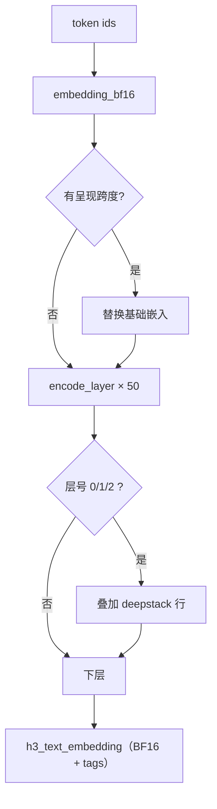
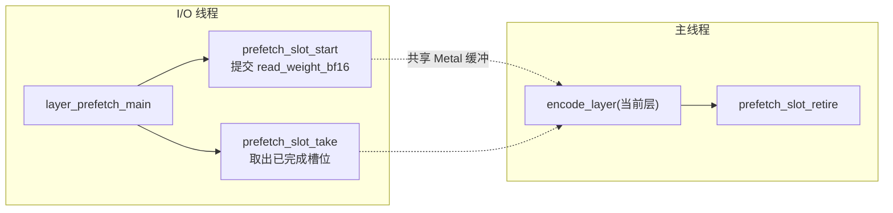

# Qwen3-VL 文本编码器

`h3_text_encoder.c`（1348 行）跑 **Qwen3-VL 的前 50 个语言层**，把 token 序列变成 DiT 消费的 BF16 条件嵌入。宽度 5120（`H3_TEXT_HIDDEN_SIZE`）。

## 三个入口

| 函数 | 场景 |
|---|---|
| `h3_text_encode_bf16` | 纯文本，跑完整 50 层 |
| `h3_text_encode_multimodal_bf16` | 带 Qwen3-VL 呈现跨度（视觉注入 + deepstack） |
| `h3_text_encode_multimodal_layers_bf16` | 前缀形式，只跑前 N 层——**用于对齐工具定位多模态失配** |

Sources: [h3_text_encoder.h](h3_text_encoder.h#L31-L65)

## 多模态呈现跨度

```c
typedef struct {
    size_t start;                    /* 跨度起始 token */
    size_t tokens;                   /* 跨度长度 */
    const uint16_t *embeddings;      /* 替换基础 token 嵌入的视觉嵌入 */
    const uint16_t *deepstack[3];    /* 三层 deepstack 增量 */
} h3_text_vision_span;
```

规则：

- 跨度内**每个** token 的基础嵌入被替换为视觉嵌入
- 三个 deepstack 行分别**加在语言层 0、1、2 之后**
- `position_ids` 是轴优先的 `[3, tokens]`
- `tags` 携带每一行的 DiT 模态 tag（语言=1，Qwen 视觉跨度含边界 token=0）

Sources: [h3_text_encoder.h](h3_text_encoder.h#L24-L52)

## 层执行



单层由 `encode_layer`（409）实现，内部依次调用 `h3_gpu_*`：RMSNorm → Q/K 的 head RMS norm + RoPE → GQA 因果注意力 → 输出投影 → 残差 → MLP（SwiGLU）。

Sources: [h3_text_encoder.c](h3_text_encoder.c#L409-L473), [h3_gpu.h](h3_gpu.h#L523-L554)

## 流式权重与预取环

这是本文件最复杂的一段。50 层的权重**不会全部驻留**，而是用一个预取环与 GPU 执行重叠：



| 元素 | 说明 |
|---|---|
| `text_prefetch_slot`（71） | 一个未来层的缓冲槽 |
| `layer_weights_load` / `_allocate` / `_read_lane` | 加载三阶段：定位 → 分配 → 读入（lane 可并行） |
| `text_prefetch_threads`（124） | 工作线程数，默认 8 |
| `text_prefetch_depth`（135） | 环深度，**M3/老硬件 2，M5 3** |

环境变量：

| 变量 | 作用 |
|---|---|
| `H3_QWEN_PREFETCH=0` | 恢复单层同步参考路径 |
| `H3_QWEN_PREFETCH=1..8` | 指定工作线程数 |
| `H3_QWEN_PREFETCH_DEPTH=1..6` | 覆盖环深度 |

Sources: [h3_text_encoder.c](h3_text_encoder.c#L61-L81), [h3_text_encoder.c](h3_text_encoder.c#L124-L144), [h3_text_encoder.c](h3_text_encoder.c#L303-L395), [README.md](README.md#L607-L612)

## 延迟释放

`defer`（91）与 `retire_deferred`（102）是一对延迟释放机制：把大张量推入待释放列表，在下一次层边界统一回收，避免在 GPU 仍在读取时释放。

Sources: [h3_text_encoder.c](h3_text_encoder.c#L91-L106)

## ClipProj 轻量路径

`h3_text_encode_clipproj_bf16`（985）是**等价替代**：用截断到抽取层的 Qwen3-VL-4B 作文本编码器，再用 ClipProj MLP 把 2560 维的抽取隐藏提升到 5120 维的 H3 条件空间。


由于输出宽度正是 DiT 期望的 5120，**DiT 完全不需要改动**。

代价对比：

| 路径 | 读取量 |
|---|---:|
| 50 层编码器 | ~62 GiB |
| 4B + ClipProj | ~5.5 GiB |

由环境变量控制，默认开启：

| 变量 | 默认 | 语义 |
|---|---|---|
| `H3_CLIPPROJ_DIR` | `/Volumes/data/.lmstudio/models/Qwen3-VL-4B-Instruct` | BF16 Qwen3-VL-4B-Instruct 目录；`0` / `off` 回退到 50 层编码器 |
| `H3_CLIPPROJ_PROJ` | `/Volumes/data/.lmstudio/models/ClipProj-MiniMax-H3` | 投影目录 |

当 ClipProj 激活时，`FL2VA/text_encoder` 在 [模型加载](model-loading) 阶段变成**可选**目录。

Sources: [h3_text_encoder.h](h3_text_encoder.h#L67-L84), [h3.c](h3.c#L434-L457), [h3.c](h3.c#L1490-L1518)

## 输出与释放

```c
void h3_text_embedding_free(h3_text_embedding *embedding);
```

调用方拥有 `values` 与 `tags`。`h3.c` 在 DiT 加载完成后立刻释放它（`h3.c:1628`），因为 DiT 已把条件烘焙进自己的常驻张量。

Sources: [h3_text_encoder.h](h3_text_encoder.h#L65-L65), [h3.c](h3.c#L1628-L1632)
