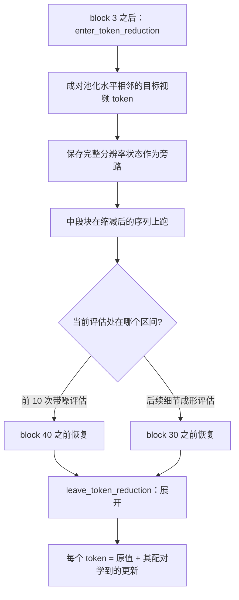

# Token 缩减

`--token-reduction` 是一个**独立的激进 DiT 加速模式**。它在中段块里把相邻的水平目标视频 token 配对，同时保留完整分辨率的残差旁路。

它不是默认档位，因为**会改变构图**。

Sources: [README.md](README.md#L521-L559)

## 算法



**关键性质**：恢复时每个 token 返回的是**原值 + 配对学到的更新**，因此**配对内部的细节不会被丢弃**。

Sources: [h3_dit.c](h3_dit.c#L2333-L2419), [h3_dit.c](h3_dit.c#L401-L497)

## 被排除在外的 token

以下**保持精确**，不参与配对：

- 文本 token
- 音频 token
- 条件 token
- 参考 token

只有**目标视频**的水平相邻 token 会被配对。奇数宽度的单个 token 不需要基线。

Sources: [README.md](README.md#L523-L525)

## 相关函数

| 函数 | 行 | 职责 |
|---|---:|---|
| `configure_token_reduction` | 401 | 依据布局与开关决定启用与否、计算缩减后的行数 |
| `token_pool_sources` | 498 | 生成配对源索引 |
| `token_reduced_parent` | 516 | 缩减 token 到其父（原）token 的映射 |
| `enter_token_reduction` / `_adaln` | 2333 / 2351 | 进入缩减区间（后者融合 AdaLN） |
| `leave_token_reduction` / `_adaln` | 2375 / 2395 | 退出缩减区间（后者融合 AdaLN） |

Sources: [h3_dit.c](h3_dit.c#L401-L516), [h3_dit.c](h3_dit.c#L2333-L2419)

## GPU 算子

```c
int h3_gpu_token_pool_bf16(...);          /* 池化 + 保存旁路 */
int h3_gpu_token_pool_adaln_bf16(...);    /* 池化 + 产出首个缩减块的注意力 AdaLN */
int h3_gpu_token_expand_delta_bf16(...);  /* 展开：原值 + 配对更新 */
int h3_gpu_token_expand_adaln_bf16(...);  /* 展开 + 融合首个全分辨率注意力 AdaLN */
```

Sources: [h3_gpu.h](h3_gpu.h#L568-L624)

## 内存上的巧思

这一串优化几乎不增加激活内存：

- **池化内核只把真配对基线写进已分配的注意力暂存缓冲的密集尾部**；奇数宽度的单 token 无需基线
- **完整旁路复用超大的 QKV 尾部**（放得下的话），只有参考密集的布局才走受保护的专用回退
- 因此**常见纯文本画布在任何 token 网格宽度下都不增加激活竞技场**
- 池化在 BF16 值已在寄存器里时顺带快照两个源 token，避免一次全隐藏 blit 与冗余的源读取
- 同一入口内核把每个池化行留在 threadgroup 内存里并产出第一个缩减块的注意力 AdaLN，又消掉一次全局残差读取
- 在恢复边界，首个全分辨率注意力 AdaLN 折进展开：一个 10.5 KiB 的 threadgroup 行避免全局残差回读，同时仍写出后续残差分支需要的精确旁路

Sources: [README.md](README.md#L530-L541)

## 实测

512×512×22、19 次 forward、热平衡 IT M5 Max A/B：

| 指标 | 值 |
|---|---:|
| 去噪时间 | 39.13 s → **28.06 s**（−28.3%） |
| 最终视频潜变量相对 L2 | 5.56% |
| 最终音频潜变量相对 L2 | 15.14% |

与已验证的 `--layers 45 --reuse 2` 组合：16.69 s → **12.60 s**（边际 −24.5%）。独立的狐狸与冲浪者渲染保持连贯。

**不要**同时叠加 `--layers 40` 与 `--reuse 3`：那次 6.47 秒的实验产生了彩色振铃、描边与重影肢体，尽管潜变量范数尚可接受。

Sources: [README.md](README.md#L541-L559)

## 诊断开关

| 环境变量 | 作用 |
|---|---|
| `H3_TOKEN_REDUCTION_BLOCKS` | 覆盖后续的 `4:30` 区间 |
| `H3_TOKEN_REDUCTION_EARLY=STEPS:END` | 覆盖早期调度；`0` 禁用 |
| `H3_DISABLE_TOKEN_REDUCTION=1` | 提供上下文内的精确对照 |
| `H3_DISABLE_FUSED_TOKEN_POOL_ADALN=1` | 恢复双内核的入口边界 |
| `H3_DISABLE_FUSED_TOKEN_ADALN=1` | 恢复双内核的出口边界 |

Sources: [README.md](README.md#L548-L553)
