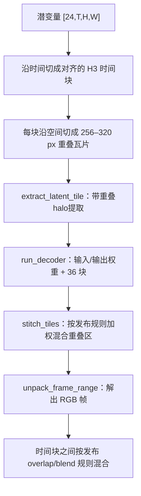

# 视频 VAE 解码

`h3_video_vae.c`（1385 行）实现视觉 VAE：一个 **36 块**的解码器，把 `[24,T,H,W]` 的归一化潜变量还原成 RGB。它同时提供编码器（供 FL2VA/Ref2VA 条件用，见 `h3_video_encoder.c` 的入口）。

## 两条解码路径

| 路径 | 入口 | 驻留 | 适用 |
|---|---|---:|---|
| **常驻解码器** | `h3_video_vae_decoder_load` → `h3_video_vae_decoder_decode` | ~9 GiB（36 块全驻留） | `--show` 实时预览、会话缓存复用 |
| **一次性** | `h3_video_vae_decode` | 用完即弃 | 单次生成、内存紧张 |

常驻解码器还能用 `h3_video_vae_decoder_preview` **每次只解一帧代表性中间帧**，用于去噪预览；预览结束后可以接着产出完整视频，无需重新加载那 9.7 GiB 权重。

Sources: [h3_video_vae.h](h3_video_vae.h#L26-L59)

## 块数常量

```c
#define H3_VIDEO_VAE_LAYERS 36
```

这个常量**专门导出**，供 [自动内存规划](memory-plan) 估算流式解码时的每块驻留开销——绝不要硬编码这个数。

Sources: [h3_video_vae.h](h3_video_vae.h#L20-L24)

## 流式 vs 常驻（重要）

解码器内部按 `vae->streaming`（来自 `h3_params.video_vae_streaming`）分叉：

- `run_resident_tile`（`h3_video_vae.c:572`）—— 36 块全部驻留，快，~9 GiB
- `run_stream_tile`（`h3_video_vae.c:622`）—— 每次载一块、跑一块、释放一块，~0.25 GiB

**两个解码入口都必须对这个标志分叉**：`decoder_decode_chunk`（常驻解码器）与 `decode_chunked`（一次性路径）。**改动时必须保持两者同步**——这是 AGENTS.md 明确点出的易错点。

Sources: [h3_video_vae.c](h3_video_vae.c#L572-L622), [h3_video_vae.c](h3_video_vae.c#L956-L1017), [h3_video_vae.c](h3_video_vae.c#L1176-L1310)

## 分块解码



关键实现点：

| 函数 | 行 | 职责 |
|---|---:|---|
| `configured_tile_pixels` | 791 | 由画布几何自动选 256–320 px 瓦片；`H3_VAE_TILE_PIXELS=256` 可恢复保守计划 |
| `tile_axis_build` | 817 | 为每个轴计算瓦片边界与重叠 |
| `extract_latent_tile` | 858 | 带 halo 提取子块 |
| `stitch_tiles` | 886 | 重叠区加权缝合 |
| `decoder_decode_chunk` | 956 | 常驻解码器的一次性块解码 |
| `unpack_frame_range` | 704 | 潜变量 → RGB F32 |

瓦片尺寸是**自动选择**的：在最小化重复重叠计算与限制峰值存储之间权衡。`H3_VAE_TILE_PIXELS` 环境变量可强制回退到原始的保守瓦片计划，用于近参考诊断。

Sources: [h3_video_vae.c](h3_video_vae.c#L704-L955), [README.md](README.md#L595-L598)

## 权重加载与预取

解码器权重大致分三批：

| 批 | 函数 | 内容 |
|---|---|---|
| 输入 | `load_input_weights` (233) | 输入卷积 |
| 块 | `load_block` (174) | 36 块的主体权重 |
| 输出 | `load_output_weights` (251) | 输出卷积 |

常驻路径由 `load_resident_weights`（550）一次性载入。权重归一化参数（`load_latent_normalization`，302）从 JSON 解析（`parse_float_array`，264）。

`vae_prefetch_thread`（221）是一个后台预取线程，由 `vae_prefetch_enabled`（227）控制开关。

Sources: [h3_video_vae.c](h3_video_vae.c#L174-L302), [h3_video_vae.c](h3_video_vae.c#L550-L571)

## 编码器侧

视觉 VAE **编码器**用于把条件图像/视频压成潜变量，入口是 `h3_video_vae_encode`（声明在 `h3_video_encoder.h`）：

- 输入：通道优先 RGB `[3,T,H,W]`，值域 `[0,1]`，空间轴必须是 16 的倍数
- 保持发布的 **256px / 64px 重叠分块**
- 输出：`[24,time,height,width]` 归一化 F32

编码器张量用**通道最后的 `[B,T,H,W,C]` 存储**；空间 padding 反射像素，时间前向 padding 补零。这两点体现在 `h3_gpu_vae_encoder_pad_f32` 与 `h3_gpu_conv3d_f32` 的签名注释里。

Sources: [h3_video_encoder.h](h3_video_encoder.h#L8-L29), [h3_gpu.h](h3_gpu.h#L268-L292)

## 输出

```c
typedef struct {
    int frames, height, width;
    float *rgb;              /* 帧优先、行优先交错的 RGB F32，值域 [0,1] */
    h3_gpu_stats gpu_stats;
} h3_video_frames;
```

`h3.c` 随后把它转成 RGB24（`h3_rgb_f32_to_u8`），按需用 vImage 放大到请求的输出尺寸，再交付给 `on_frame` 与 ffmpeg。

Sources: [h3_video_vae.h](h3_video_vae.h#L8-L15), [h3.c](h3.c#L1730-L1751)
