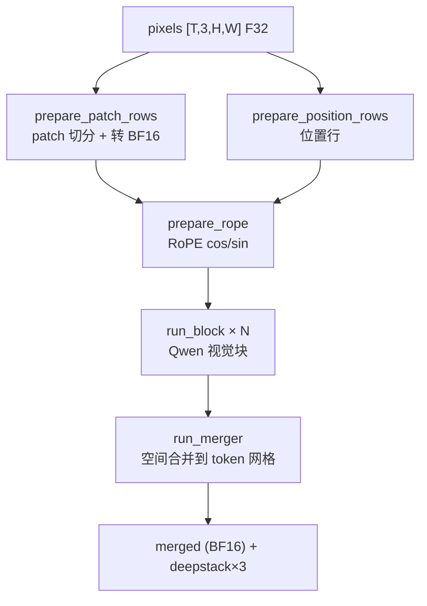
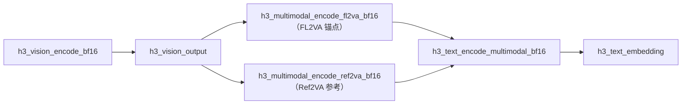

# Qwen 视觉塔与 Deepstack

`h3_vision_encoder.c`（633 行）把一张图或**一个两帧视频块**编码成 Qwen3-VL 的视觉呈现行。它是 FL2VA 锚点与 Ref2VA 参考共用的视觉前端。

## 契约

```c
#define H3_VISION_OUTPUT_WIDTH 5120u
#define H3_VISION_DEEPSTACKS 3u

typedef struct {
    int grid_h, grid_w;
    size_t tokens;
    uint16_t *merged;                        /* BF16 呈现行 */
    uint16_t *deepstack[H3_VISION_DEEPSTACKS];
    h3_gpu_stats gpu_stats;
} h3_vision_output;

int h3_vision_encode_bf16(const char *weight_directory,
                          const char *shader_source_path,
                          const float *pixels, int frames,
                          int height, int width,
                          h3_vision_progress progress, void *progress_opaque,
                          h3_vision_output *output,
                          char *error, size_t error_size);
```

输入像素是 F32 `[T,3,H,W]`，值域 `[0,1]`；`T` 必须是 **1 或 2**；`H`/`W` 必须是 **32 的倍数**。

Sources: [h3_vision_encoder.h](h3_vision_encoder.h#L9-L33)

## 流水线



| 函数 | 行 | 职责 |
|---|---:|---|
| `prepare_patch_rows` | 135 | 像素 → patch 行 + BF16 转换 |
| `prepare_position_rows` | 163 | 生成位置索引 |
| `prepare_rope` | 215 | 计算 RoPE 的 cos/sin 表 |
| `load_block_weights` | 250 | 加载单个视觉块权重 |
| `run_block` | 288 | 执行一个视觉块 |
| `run_merger` | 350 | 合并到最终 token 网格并产出 deepstack |

Sources: [h3_vision_encoder.c](h3_vision_encoder.c#L135-L427)

## 逐块加载

视觉塔权重**逐块加载、逐块释放**（`load_block_weights` / `free_block_weights`），与文本编码器的预取环不同——这里没有异步预取，因为视觉塔相对小得多。

Sources: [h3_vision_encoder.c](h3_vision_encoder.c#L242-L287)

## 三个 Deepstack 层

`deepstack[0..2]` 是**三个同形状的增量张量**，分别叠加在语言层的 **0、1、2 之后**。这是 Qwen3-VL 的三层 deepstack 视觉注入，由 [Qwen3-VL 文本编码器](text-encoder) 的 `h3_text_encode_multimodal_bf16` 消费。

Sources: [h3_vision_encoder.h](h3_vision_encoder.h#L16-L19), [h3_text_encoder.h](h3_text_encoder.h#L40-L52)

## 视频的两帧分块

Qwen 以**时间优先的两帧块**消费视频，而媒体边界是通道优先的 `[3,T,H,W]`。转换由 `h3.c` 的 `h3_extract_vision_pair` 完成：

```c
/* 源：[channel][time][h][w]；目标：[time][channel][h][w]，T=2 */
for (int time = 0; time < 2; time++)
    for (int channel = 0; channel < 3; channel++) {
        size_t source      = ((size_t)channel * frames + times[time]) * area;
        size_t destination = ((size_t)time * 3 + channel) * area;
        memcpy(pair + destination, pixels + source, area * sizeof(float));
    }
```

采样规则：每 12 帧取一个样本，每 2 个样本组成一个块；奇数样本越界时重复前一个。

Sources: [h3.c](h3.c#L850-L872), [h3.c](h3.c#L1429-L1457)

## 调用方



视觉输出在文本编码完成后**立即释放**（`h3.c:1482-1483`），因为语言层已经把它们烘焙进嵌入。

Sources: [h3.c](h3.c#L1467-L1483), [h3_multimodal.h](h3_multimodal.h#L15-L52)

## 调试支持

`debug_tensor`（70）与 `debug_sync`（124）提供了张量内容转储与同步点，用于把原生视觉塔的输出与 MLX oracle 逐层对照。这是 [测试与数值对齐](test-suite) 里 `test_real_qwen_vision.c` 的基础。

Sources: [h3_vision_encoder.c](h3_vision_encoder.c#L70-L133)
