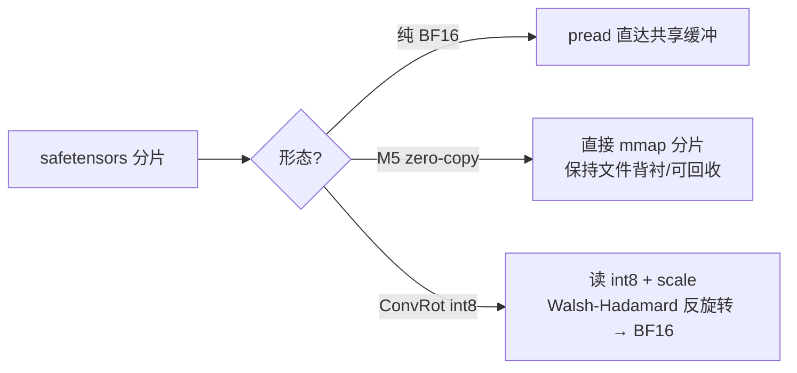

# 权重与 safetensors

权重加载是三层结构：**原始 safetensors → 组件级权重存储 → 设备映射**。三层各司其职，共同保证「33B 权重不产生中间 host 分配」。

## 第一层：h3_safetensors.c

纯 C 的 safetensors 解析器，不依赖任何第三方。

```c
typedef struct {
    char *name;
    h3_dtype dtype;
    int ndim;
    uint64_t shape[8];
    uint64_t data_begin, data_end, file_offset;
} h3_st_tensor;

typedef struct {
    char *path;
    uint64_t file_size, header_size;
    h3_st_tensor *tensors;
    size_t tensor_count;
} h3_st_header;
```

| 函数 | 职责 |
|---|---|
| `h3_st_read_header` | 解析单个文件的 JSON 头（含 8 字节长度前缀） |
| `h3_st_free_header` | 释放 |
| `h3_st_find` | 按名查找张量 |
| `h3_st_tensor_elements` | 元素个数 |
| `h3_st_read_data` | 按已解析的偏移读数据 |
| `h3_st_inventory_dir` | **目录级统计**：总字节、张量字节、文件数、张量数 |

`h3_st_inventory_dir` 是关键：它让 [自动内存规划](memory-plan) 能在**不读任何载荷**的情况下知道每个组件有多大。

Sources: [h3_safetensors.h](h3_safetensors.h#L9-L56)

## 第二层：h3_weights.c

```c
h3_weight_store *h3_weight_store_open(const char *directory,
                                      char *error, size_t error_size);
const h3_st_tensor *h3_weight_find(const h3_weight_store *store,
                                   const char *name, const h3_st_header **header);
h3_gpu_tensor *h3_weight_load_bf16(const h3_weight_store *store, h3_gpu *gpu,
                                   const char *name, int ndim,
                                   const uint64_t *shape,
                                   char *error, size_t error_size);
```

`h3_weight_store_open` 打开一个组件目录下的**所有**分片头（`safetensors_name` + `compare_paths` 保证分片按自然序），但不读任何张量载荷。

`h3_weight_load_bf16` 的三步是原子的：

1. `h3_weight_find` 定位张量与所在分片
2. 校验 dtype 与形状**精确匹配**
3. 分配共享 Metal 缓冲并把 payload `pread` 进去

Sources: [h3_weights.h](h3_weights.h#L12-L35), [h3_weights.c](h3_weights.c#L44-L132), [h3_weights.c](h3_weights.c#L436-L457)

## 第三层：h3_gpu.m

`h3_gpu_tensor_load_bf16` / `_f32` / `_i8` 分配共享 Metal 存储并直接 pread。两个变体：

```c
int h3_gpu_tensor_read_file_bf16(...);    /* 普通 */
int h3_gpu_tensor_stream_file_bf16(...);  /* 请 Darwin 不保留文件缓存副本 */
```

Sources: [h3_gpu.h](h3_gpu.h#L51-L69)

## 三种权重形态



| 形态 | 条件 | 关键性质 |
|---|---|---|
| 纯 BF16 | 默认 | 最直白，无中间分配 |
| M5 zero-copy | M5 级 GPU | 持久变换器权重从分片映射而非拷进匿名共享缓冲，让 37 GiB 保持文件背衬/可回收，且略微改善总变换器时间 |
| ConvRot int8 | `H3_CONVROT_*` | 存储减半，加载时 CPU 侧反旋转还原真权重 |

M3 使用**更快的拷贝缓冲路径**，不走 zero-copy。

`H3_ZERO_COPY_WEIGHTS=0` 可关闭 M5 的选择用于诊断。

Sources: [h3_weights.c](h3_weights.c#L160-L206), [README.md](README.md#L600-L612)

## dtype 支持

```c
typedef enum {
    H3_DTYPE_UNKNOWN, H3_DTYPE_BOOL, H3_DTYPE_I8, H3_DTYPE_U8,
    H3_DTYPE_I16, H3_DTYPE_U16, H3_DTYPE_F16, H3_DTYPE_BF16,
    H3_DTYPE_I32, H3_DTYPE_U32, H3_DTYPE_F32, H3_DTYPE_I64,
    H3_DTYPE_U64, H3_DTYPE_F64
} h3_dtype;
```

解析器支持全 dtype 集，但**加载路径**只暴露 BF16 / F32 / I8 三个入口（`h3_weight_load_bf16` / `_f32` / `_i8`）。需要其它 dtype 时，`h3_weights.c` 内部用 `f16_to_f32`（302）与 `f32_to_bf16_u16`（184）做转换。

Sources: [h3_safetensors.h](h3_safetensors.h#L9-L24), [h3_weights.h](h3_weights.h#L25-L34)

## 卸载时机

`h3_weight_store_free`（119）只释放分片头与张量元数据，**不管已映射的 GPU 张量**——后者由各子系统的 `free_*` 负责。

这个分工很重要：权重存储的生命周期可以比它映射出的张量短，因为一旦 payload 进了共享缓冲，safetensors 头就只是索引。

Sources: [h3_weights.c](h3_weights.c#L119-L131)

## 与加载顺序的关系

各子系统按**阶段**加载权重，用完即弃：

```
text_encoder        → 条件构建期加载，完成后释放
video_vae (encoder) → 条件构建期加载，完成后释放
audio_vae (encoder) → 条件构建期加载，完成后释放
transformer (DiT)   → 去噪期常驻（或 2 块轮转）
video_vae (decoder) → 解码期常驻（或 1 块轮转）
audio_vae (decoder) → 解码期加载，完成后释放
```

这让 33B 变换器、Qwen 编码器与两个解码器**永远不必同时驻留统一内存**。

Sources: [h3.c](h3.c#L1628-L1633), [h3.c](h3.c#L1690-L1699)
